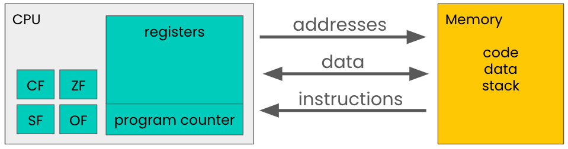

# Condition Codes

## Definition and Purpose

   Condition codes, also known as flags, are a set of binary indicators that are stored in a dedicated register called the FLAGS register in the x86 architecture, or RFLAGS in the x86-64 architecture. These flags are set or cleared (1 or 0) by the CPU based on the results of an arithmetic, logical, or comparison operation. Key flags include the Zero Flag (ZF), Sign Flag (SF), Carry Flag (CF), Overflow Flag (OF), and Parity Flag (PF), among others. We can represent this in our model of the machine as follows:

   

   Condition codes are used for decision-making and controlling the flow of a program. They are used by conditional branch instructions (like `JE` for "jump if equal" or `JNE` for "jump if not equal") to determine the next course of action. For example, after a comparison instruction, if the Zero Flag is set, it indicates that the compared values are equal, and a conditional jump can be taken based on that condition. This allows for the implementation of loops, if-else statements, and switch cases.

## Overview of the Flags Registers

Each flag within the register represents a specific condition that may occur after an arithmetic or logical operation:

1. **Zero Flag (ZF)**: Set to 1 if the result of an operation is zero; otherwise, it's set to 0. It's commonly used in loops and conditional statements to check for equality.
2. **Sign Flag (SF)**: Reflects the sign of the result of an operation. If the result is negative, SF is set to 1; if positive, it's set to 0. This flag is useful for signed comparisons.
3. **Carry Flag (CF)**: Used in arithmetic operations to indicate a carry out of the most significant bit, which can signal an overflow or underflow for unsigned operations. It's also used for extended precision arithmetic.
4. **Overflow Flag (OF)**: Indicates when an operation generates a result too large for the destination operand to hold, which is particularly relevant for signed operations.

## Instructions that Affect Condition Codes

**Arithmetic operations**: Instructions like `ADD` (addition) and `SUB` (subtraction) affect flags such as the Zero flag (ZF), Sign flag (SF), Overflow flag (OF), and Carry flag (CF).

- 🚩 **Zero flag (ZF)**: Set if the result is zero.
- 🚩 **Sign flag (SF)**: Set if the result is negative.
- 🚩 **Overflow flag (OF)**: Set if there's an arithmetic overflow.
- 🚩 **Carry flag (CF)**: Set if there's a carry out or borrow in the operation.

**Logical operations**: Instructions like `AND`, `OR`, and `XOR` typically affect the Zero flag and may also affect the Sign flag, but not the Carry or Overflow flags.

- 🚩 **Zero flag (ZF)**: Set if the result is zero.
- 🚩 **Sign flag (SF)**: Set if the result is negative.

**Comparison operations**: Instructions like `CMP` (compare) and `TEST` perform a subtraction or AND operation without actually storing the result, just to set the appropriate flags for conditional branching.

Below is a table showing examples of different values of two registers used with the `subw` instruction. The `subw` instruction subtracts the second operand from the first and stores the result in the first operand. This table illustrates how the various flags are affected based on differing combinations of signed and unsigned operand values of different sizes.  Note that hexadecimal values are used to represent the operands.

| Operand 1 (`dest`) | Operand 2 (`src`) | Result (`dest - src`) | ZF | SF | CF | OF | Explanation                                                                                                   |
|--------------------|--------------------|-----------------------|---|----|----|----|---------------------------------------------------------------------------------------------------------------|
| 0x03E8             | 0x01F4             | 0x01F4                | 0 | 0  | 0  | 0  | Normal subtraction, result is positive, not zero. (1000 - 500 = 500)                                          |
| 0x01F4             | 0x03E8             | 0xFC06 (as signed)    | 0 | 1  | 1  | 0  | Result is negative in 16-bit signed, CF is set as it requires a borrow in unsigned arithmetic. (500 - 1000)   |
| 0x0000             | 0x0000             | 0x0000                | 1 | 0  | 0  | 0  | Result is zero, sets ZF.                                                                                      |
| 0x8000             | 0x0001             | 0x7FFF                | 0 | 0  | 1  | 1  | Subtracting 1 from the smallest negative number (in 16-bit) causes an overflow and unsigned underflow.        |
| 0x7FFF             | 0xFFFF             | 0x8000                | 0 | 1  | 0  | 1  | Subtracting -1 from the largest positive number (in 16-bit) causes an overflow. (32767 - (-1))                |
| 0xFFFB             | 0xFFF6             | 0x0005                | 0 | 0  | 0  | 0  | Subtracting a larger negative number results in a positive. (-5 - (-10) = 5)                                  |

## Interpreting the Condition Codes

The `set` instructions are a group of instructions used to evaluate the condition codes and set a specific register or memory location to a value based on that evaluation, typically 0 or 1.  Here's a brief explanation of how `set` instructions use condition codes:

1. **Execution of Preceding Instructions**: Before a set instruction is executed, some arithmetic or logical operation takes place. For example, a subtraction (`SUB`) or a comparison (`CMP`) instruction is executed.

2. **Updating Condition Codes**: The result of this operation updates the condition codes in the status register.  For instance, if the result of the operation is zero, the Zero flag is set.

3. **Set Instruction Evaluation**: The set instruction then reads these condition codes. Each set instruction is designed to respond to specific flags. For example, `SETNE` (set if not equal) or `SETZ` (set if zero) will check the Zero flag.

4. **Setting the Result**: Depending on the condition codes and the specific set instruction, the target register or memory location is set to 1 (true) or 0 (false). For example, if `SETNE` is used and the Zero flag is not set (indicating the previous comparison was not equal), the instruction will set the destination to 1.

5. **Continuation of Program**: The program then continues with the result of the set instruction, which can be used for conditional branching or other logical decisions.

Here's a simple example in assembly-like pseudocode:

```assembly
CMP R1, R2      ; Compare the values in registers R1 and R2
SETNE R3        ; If R1 is not equal to R2, set R3 to 1, otherwise set to 0
```

In this case, if `R1` is not equal to `R2`, the Zero flag will not be set, and `SETNE` will set `R3` to 1. If `R1` and `R2` are equal, the Zero flag will be set, and `R3` will be set to 0.

The various version of the `set` instruction set a byte to 1 or 0 based on the state of the above flags. These instructions are often used after a comparison or arithmetic operation to take action based on specific conditions. Here's a table illustrating this for different `set` instructions:

| Instruction  | Condition                                | Description of Condition  |
|--------------|------------------------------------------|---------------------------|
| `sete`       | Equal / Zero                             | ZF                        |
| `setne`      | Not Equal / Not Zero                     | ~ZF                       |
| `sets`       | Negative                                 | SF                        |
| `setns`      | Non-Negative                             | ~SF                       |
| `setg`       | Greater (Signed)                         | ~ZF & ~(SF ^ OF)          |
| `setge`      | Greater or Equal (Signed)                | ~(SF ^ OF)                |
| `setl`       | Less (Signed)                            | SF ^ OF                   |
| `setle`      | Less or Equal (Signed)                   | ZF | (SF ^ OF)            |
| `seta`       | Above (Unsigned)                         | ~CF & ~ZF                 |
| `setae`      | Above or Equal (Unsigned)                | ~CF                       |
| `setb`       | Below (Unsigned)                         | CF                        |
| `setbe`      | Below or Equal (Unsigned)                | CF | ZF                   |
| `seto`       | Overflow                                 | OF                        |
| `setno`      | Not Overflow                             | ~OF                       |

> **Check Your Understanding**: The `setbe` instruction results in true if the condition is below or equal (unsigned). Similarly the `setae` instruction results in true if the condition is above of or equal (unsigned).  What are the expressions based on the condition codes that would calculate these results (i.e., what belongs in the third column above for these instructions).
> <details><summary>Click Here for the Answer</summary>`setbe` is calculated as CF | ZF. `setae` is calculated as ~CF.</details>

Now we have a deeper understanding of the condition codes, the various instructions that set them, and the instructions that we can use  to interpret the meaning of the values of the condition codes.  In the next section, we will see how we use these instructions for controlling the flow of a program in decision statements and loops.