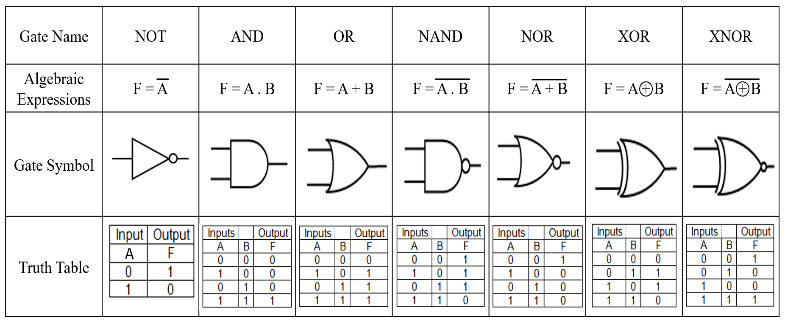
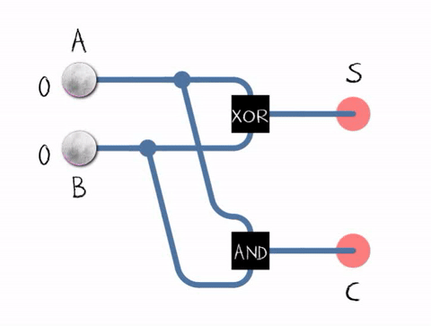

# Digital Logic Design

Before we get into the specifics of microprocessor design, we need to familiarize ourselves with some concepts of digital logic design.

Digital electronics is a vast field, encompassing the principles and techniques used to design and implement electronic circuits and systems that process and manipulate digital signals. Understanding these basics is key to grasping how computers and other digital devices function at the most fundamental level.

In digital circuits, logic levels correspond to the digital values of 0 (low voltage) and 1 (high voltage). Unlike analog signals, which can vary continuously, digital signals switch between fixed logic levels. This characteristic of having discrete values representing discrete states leads to a more robust and noise-resistant form of data transmission, which is required in computing and digital communications.

## Introduction Logic Gates

At the heart of digital design are logic gates, the fundamental components that process binary signals.  

Imagine logic gates as tiny decision-makers that take in binary inputs where 0 represents "off" or "false," and 1 represents "on" or "true." These gates make logical decisions based on the rules of Boolean algebra.  

Each type of logic gate has a specific function and symbol that represents its operation in circuit diagrams (shown below).  The output of the logic gate immediately (or nearly immediately) updates when the values on the inputs to the gates change.

*Source: https://www.researchgate.net/figure/Topics-of-basic-logic-gates_fig3_350016075*

The AND gate, for instance, outputs a 1 when every input is 1. Conversely, the OR gate outputs a 1 if at least one input is 1.  Building on these basics, we have the NAND and NOR gates, which are the negations of the AND and OR gates, respectively.

To predict the behavior of these gates, we use truth tables, which exhaustively list the output for every possible input combination. Boolean expressions, akin to algebraic formulas, provide a compact mathematical representation of the logic gate's function.

Finally, when we visualize these gates in circuit diagrams, we see the flow of logic as it travels through the network of gates, each performing its task to contribute to the overall function of the digital system.

Before continuing, please read [Section 3.1 of *An Animated Introduction to Digital Logic Design*](https://digitalcommons.njit.edu/oat/1/).

## Combining Logic Gates

The true power of logic gates is unleashed when we combine them to perform complex operations. This involves using multiple gates in various configurations to realize more complex logical functions. For instance, combining AND, OR, and NOT gates can create a NAND gate, which forms the basis for creating flip-flops, a fundamental component in memory storage and data processing.

A classic example of creating a more complex *combinational* logic circuit using basic logic gates is the design of a "Half Adder." A Half Adder is a fundamental circuit in digital electronics used to perform the addition of two single-bit binary numbers. It's a great example of how combining simple logic gates can lead to more complex functionalities, such as arithmetic operations.

### Half Adder Circuit

The Half Adder circuit takes two single binary digits (bits) as input and produces two outputs: Sum and Carry. The Sum represents the addition result, and the Carry indicates whether there's a carry-out from the addition.

To figure out what the correct combination of logic gates is for the Half Adder, we can construct a *truth table*.  the truth table shows what the different outputs should be based on all the possible combinations of inputs.  The truth table for the Half Adder is as follows:

| A (Input) | B (Input) | Sum (S) | Carry (C) |
|-----------|-----------|---------|-----------|
| 0         | 0         | 0       | 0         |
| 0         | 1         | 1       | 0         |
| 1         | 0         | 1       | 0         |
| 1         | 1         | 0       | 1         |

Inspection of this truth table will reveal that the the combination of XOR (for the Sum bit) and AND (for the Carry bit) gates effectively handles the binary addition of two single bits, resulting in the following circuit:

*Source: https://en.m.wikipedia.org/wiki/Adder_(electronics)#/media/File%3AHalfadder.gif*

There are a variety of methods available to digital logic designers to determine and optimize the combination of logic gates that must be used to build more complex circuits, however this is not the focus of this class and we will not go into them.  However, if you would like to find out more, read [Chapter 2 and 3 of *An Animated Introduction to Digital Logic Design*](https://digitalcommons.njit.edu/oat/1/).

