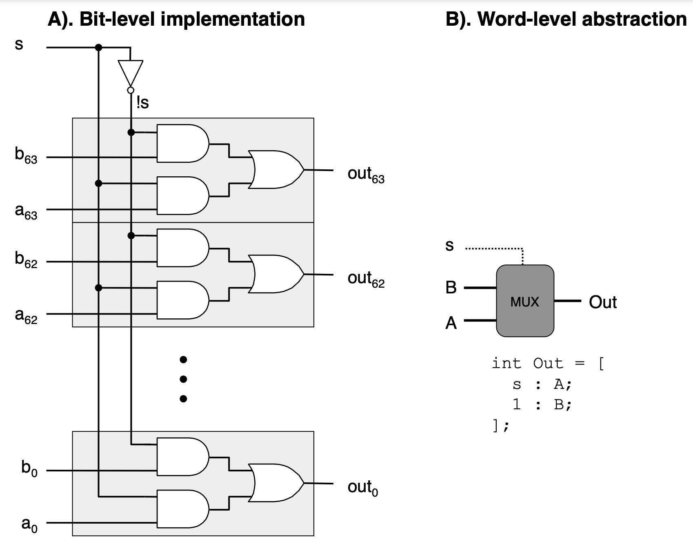
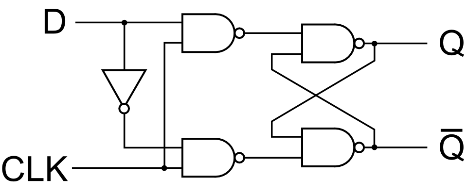
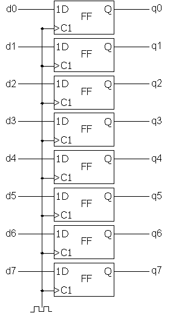
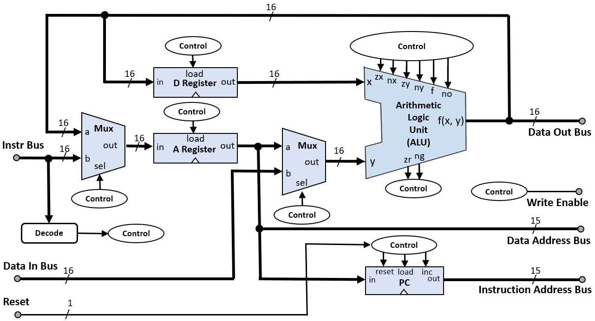

# Combinational vs. Sequential Circuits

Combinational and sequential circuits are two fundamental types of digital circuits used in electronics and computer systems. Here's a concise overview:

## Combinational Circuits

Imagine combinational circuits as skilled mathematicians who make decisions based solely on the numbers you provide at that moment. They don't ponder past numbers or anticipate future ones; they focus on the present. This lack of memory elements means their outputs are determined entirely by the current inputs they receive.

Prime examples of combinational circuits are those used in the arithmetic logic unit (ALU) within a CPU. The ALU is a complex, capable of performing a variety of operations such as arithmetic calculations and logical comparisons based on the current inputs,  without the need to remember past inputs.

In addition to the Half Adder that we previously discussed, there are some other combinational circuits of illustrative value.  One is the single-bit multiplexor (or MUX).  A single-bit multiplexer (MUX) is a digital switch that selects one of several input signals and forwards the selected input into a single line. A basic multiplexer has multiple data input lines, one or more control inputs, and one output. In the case of a single-bit 2-to-1 multiplexer, there are two data inputs, one control input, and one output. The control input determines which of the two data inputs is connected to the output.

Here's the truth table for a single-bit 2-to-1 multiplexer:

| Control (C) | Input 0 (I0) | Input 1 (I1) | Output (O) |
|-------------|--------------|--------------|------------|
| 0           | 0            | X            | 0          |
| 0           | 1            | X            | 1          |
| 1           | X            | 0            | 0          |
| 1           | X            | 1            | 1          |

- **Control (C)**: This is the control input that selects which data input is connected to the output.
- **Input 0 (I0) and Input 1 (I1)**: These are the two data inputs. The output will be one of these inputs, depending on the state of the control input.
- **Output (O)**: This is the output of the multiplexer.  The output can be represented logically as `O = (!S . I0) + (S & I1)`.  Using the symbolic representations of logic gates, draw this combinational circuit out on paper and prove to yourself that it implements the above truth table.

In the truth table, 'X' represents a 'don't care' condition, meaning it can be either 0 or 1. The output depends solely on the value of the control input and the corresponding data input line. If the control input is 0, the output is the same as Input 0 (I0); if the control input is 1, the output is the same as Input 1 (I1).

We can also assemble multiple copies of these bit-level circuits to create word-level (i.e., 8-, 16-, 32-, 64-bit versions).  You can imagine that as the number of bits increases, the number of logic gates that are necessary to implement the circuit increases rapidly. This is an example of constructing a 64-bit MUX using the single-bit version of the prior example.

*Source: https://csapp.cs.cmu.edu/3e/ics3/arch/logic-word-mux.pdf*

## Sequential Circuits

The defining characteristic of sequential circuits is their incorporation of memory elements, typically in the form of flip-flops. These memory elements enable the circuits to retain a sense of history, storing the state of past inputs. As a result, the output of a sequential circuit is a reflection of both the current inputs and the accumulated knowledge of previous inputs.  

### Example: D Flip-Flops

Let's explore the flip-flop circuit in more detail. A D flip-flop, also known as a data or delay flip-flop, is a type of flip-flop that captures the value of the data input (D) at a particular moment in time and outputs this value until the next capture. The capture is controlled by a clock signal (CLK). D flip-flops are widely used for their simplicity and reliability in storing a single bit of data.

- **Data Input (D):** The input value that is to be stored in the flip-flop.
- **Clock Input (CLK):** A timing signal that determines when the data input is sampled and transferred to the output.
- **Output (Q):** The current state of the flip-flop, which holds the last sampled data input.
- **Complementary Output (Q'):** The inverse of the output (Q), providing the complement of the stored bit.

The behavior of a D flip-flop can be summarized by the following truth table:

| CLK | D | Q (next state) | Q' (next state) |
|-----|---|----------------|-----------------|
| ↑   | 0 | 0              | 1               |
| ↑   | 1 | 1              | 0               |

The CLK column with the upward arrow (↑) indicates that the state change occurs on the rising edge of the clock signal. The D column represents the data input, and the Q and Q' columns show the state of the outputs after the clock edge.

A D flip-flop can be constructed using various logic gates. Here's a basic representation using NAND gates:

*Source: https://electronics.stackexchange.com/questions/497756/what-is-the-relevance-of-a-q-in-the-d-flip-flop-when-using-for-a-memory-module*

> **Check Your Understanding**: Take a moment and study this circuit to prove to yourself that it implements the behavior described in the truth table.

In this diagram, the D input is connected to one input of the first NAND gate, while the CLK signal is connected to the other inputs of the NAND gates that control the timing of the data capture. The output Q is fed back into the circuit to maintain the state between clock cycles.

When the clock signal transitions from low to high (rising edge), the value at the D input is "locked in" and appears at the Q output. The Q output will remain in this state until the next rising edge of the clock signal, even if the D input changes in the meantime.

### Registers

Registers can be designed with various sizes (8-bit, 16-bit, 32-bit, etc.) by simply increasing the number of D flip-flops and ensuring they are all connected to the same control signals. They are fundamental components in digital systems for holding data, instructions, addresses, and for implementing memory elements and finite state machines.

D flip-flops are combined in parallel to create registers, with each flip-flop responsible for storing one bit of the register's total data capacity. Here's how they are typically combined:

1. **Common Clock:** All D flip-flops in the register share a common clock signal (CLK). This ensures that each bit is captured simultaneously on the clock's rising or falling edge, depending on the flip-flop's design.

2. **Data Inputs:** Each D flip-flop has its own data input (D). The binary data to be stored in the register is presented in parallel to these inputs.

3. **Outputs:** Each flip-flop's output (Q) represents one bit of the register. The outputs of all flip-flops together form the binary data stored in the register.

Here's a simplified representation of an 8-bit register using D flip-flops:

*Source: https://commons.wikimedia.org/wiki/File:Register_8bit.png*

When the clock signal is pulsed, each flip-flop captures the value present at its D input and holds this value at its Q output until the next clock pulse. This simultaneous capturing of bits across all flip-flops in the register allows for multi-bit data to be stored and manipulated as a single unit.

### Summary

This ability to remember gives sequential circuits the power to perform tasks that require an awareness of past events. They are the foundation of devices that need to keep track of progression or store information. Counters, for instance, rely on sequential circuits to tally events over time. Registers serve as temporary storage for data being manipulated by a CPU, holding onto bits and bytes as needed.

Control Unit logic relies heavily on sequential circuits. It uses the stored state information to manage the execution of instructions, coordinate timing, and control data flow. The control unit's ability to remember and act upon a sequence of events is what allows a CPU to execute complex instruction sets efficiently.

## Cental Processing Unit Schematic

This is a schematic of a basic CPU (one much simpler than an x86).  Now that we have covered how some of these circuits are constructed using logic gates, you should be able to trace what some of the behavior of the CPU might be.  

*Source: https://en.m.wikipedia.org/wiki/File:Hack_Computer_CPU_Block_Diagram.png*

Several key components work together to execute instructions and process data. The central elements typically include multiplexers (muxes) for input selection, registers for data storage, control signals for managing operations, an Arithmetic Logic Unit (ALU) for performing computations, and a program counter (a special register) for tracking the sequence of instructions.

**Multiplexers (Muxes):**
Multiplexers are used to select between different data sources or inputs based on control signals. In this schematic, you can see that muxes are used leading to the 'y' input into the ALU to choose between immediate values provided by an instruction, data from registers, or inputs from I/O devices. 

**Registers:**
Registers are small storage units within the CPU that hold data temporarily. They can store operands for the ALU, results of computations, or any data that needs to be quickly accessed by the CPU. Common registers include the accumulator, index registers, stack pointer, and general-purpose registers. Control signals determine when data is loaded into or read from the registers.

**Control Signals:**
Control signals orchestrate the operation of the CPU. They are generated by the control unit based on the current instruction being executed. These signals enable or disable various parts of the CPU, such as telling a register when to capture data, instructing the ALU on which operation to perform, or controlling the flow of data through muxes.

**Arithmetic Logic Unit (ALU):**
The ALU is the computational heart of the CPU, capable of performing arithmetic operations (like addition and subtraction) and logic operations (such as AND, OR, and NOT). It takes operands from registers, processes them according to the control signals, and outputs the result, which can be stored back into a register or used in subsequent operations.

**Program Counter (PC):**
The program counter is a specialized register that keeps track of the address of the next instruction to be executed. After each instruction is fetched, the PC is incremented to point to the following instruction in memory. In some cases, the PC can be modified by control signals to implement jumps or branches in the program flow.

## Conclusion

There is one other element that is key to how modern CPUs operate that we haven't spent much time discussing yet.  This is the clock signal, which we will discuss next.
