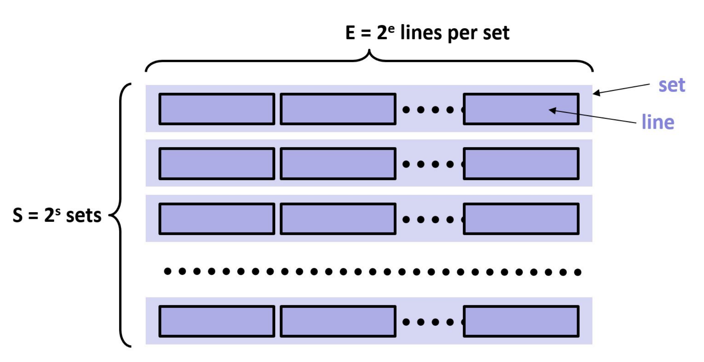
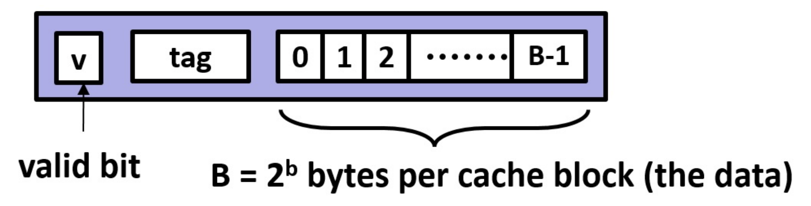

# Assignment 5: Exploring Memory Hierarchy and Cache Utilization

In this activity, you may work in pairs or individually.  **You may not use ChatGPT or similar tools in any way, shape,
or form on this activity. If there is any indication that one of those tools was used, you will received an automatic
zero.** Instead, working with your peer to do your best answering the questions throughout. Many of the questions are
are open-ended, and thus have many possible answers, so I would expect them to vary widely between submissions.

## Instructions

You will answer each of the below questions and submit them via the online assignment in Gradescope.  I encourage you to
spend some time thinking through these questions, working them out of paper (making notes and drawing pictures, where
necessary).  Then, after you feel good about your answer, enter them into Gradescope.

### Model 1: Caches

Imagine you're an aspiring chef collecting recipes and cooking utensils as you progress in your culinary journey. You
can store your culinary items in three places: your kitchen, your pantry, and the grocery store.

1. When you are in cooking right now, which place is the most convenient? Where is the least convenient?
2. Which place can hold the most ingredients and utensils?
3. When you leave your kitchen to serve food elsewhere, how do you pick what items to bring with you?
4. How might you change your utensils and ingredients with you in the kitchen when you are cooking a new recipe?

### Model 2: Lookup

When a program tries to access memory, before the request goes onto the bus, it is passed through one or more caches.
Each cache must quickly answer the question: does it have the data?

1. If the array below starts at (32-bit) address `0x00 00 FF 00`, what is the address of the last element?

    ```C
    int array[20];
    ```

2. Considering the four bytes of a 32-bit address, which address byte relates most to spatial locality?
3. A cache is very similar to a hash table. As we have learned, we want hash values to be across a large range. Caches
use a very simple hashing algorithm of selecting a subset of the address bits. Discuss which range(s) you might use.
4. (advanced) Which part of the address often indicates whether the access is to the stack, heap, or global variables?

Unlike a hash table, caches do not resize, rehash, or otherwise move elements. Caches chain elements to a limited extent
if they hash to the same location in the cache.

### Model 3: Hardware

We can describe a cache using three numbers: $S$, $E$, and $B$. Let's break down what each of these parameters
represents and how the first two relate to cache organization:

- **$S$ (Set count):** This represents the number of sets in the cache. A set is a collection of cache lines where
   any new block from memory can be placed. The cache is divided into $S$ sets to allow for more efficient data
   storage and retrieval. The way a block is mapped to a specific set can vary based on the cache's mapping strategy
   (direct-mapped, fully associative, or set-associative).

- **$E$ (Number of cache lines per set):** This represents the number of cache lines (or blocks)
   in each set. If $E = 1$, the cache is *direct-mapped*, meaning each set contains only one cache line. If $E$ is
   equal to the total number of cache lines, the cache is *fully associative*, meaning a block can be placed in any cache
   line. If $E$ is between 1 and the total number of cache lines, the cache is *set-associative*, meaning each set
   contains $E$ cache lines, and a block can be placed in any of the lines within a given set.

- **$B$ (Block size):** This represents the size of each cache block (or line) in bytes. Each block is a unit of
   data transferred between the cache and main memory, and $B$ determines how much data is moved and stored in each
   cache operation.

These parameters ($S$, $E$, and $B$) together define the cache's size, structure, and behavior, impacting
its performance, efficiency, and cost. Understanding how $S$ and $E$ relate helps in designing and analyzing
cache systems, balancing trade-offs between speed, size, and cost.

The following figure shows how the first two relate to the cache organization.

1. The hashing bits from the previous model are actually the set index bits. If there are $S$ sets, how many bits are
required for this purpose?

    

2. Cache lines contain blocks of data. The spatial locality bits are the block offset, which select the byte(s) from the
block to return. How many bits are required for this purpose?
3. On selecting a cache set using the index bits, the cache must search (simultaneously as this is hardware) all of its
lines to see whether any match the address. Each check is done using the remaining bits of the address. These bits are
the tag. If $m$ is the number of address bits, how many bits are in the tag ($t$)?

    

Cache lines also contain a valid bit to store whether this line is valid. Sets in caches will have one or more lines. If
there is only one line, that cache is termed ‘direct mapped’. If there is only one set, then the cache is termed ‘fully
associative’. Otherwise, the cache is considered E-way associative.

4. Associativity has trade-offs. Remember that hardware costs space and energy. Between direct mapped and fully
associative, select the one that:
   - Requires the most hardware
   - Can determine whether a cache line is present fastest
   - Is more likely to have the data present
5. There are three basic types of cache misses. We also rate caches for their miss rates, which are misses/accesses.
When an address is read for the very first time, where is it?
6. The program accesses `array[0]`, `array[1]`, `array[2]`, and `array[3]` (see Model 2). At minimum, how large should $B$
be for there to be (ideally) only 1 miss?

### Model 4: Replacement

Although not all college students do this (take for example one of my roommates!), let’s consider hanging your shirts in
a closet. Imagine that your closet has limited space, but that you also have a box under your bed to store additional
clothes.

1. Your closet is full and you have received a new shirt. How do you make room in your closet for
this shirt?
    - Pick randomly
    - Box up the newest shirt
    - Box up your oldest shirt
    - Box up a shirt you haven’t worn in a while
    - I use a different policy to replace my shirts (seasonal, etc)
2. For the previous question, what additional information would you need to:
   - Make the decision
   - Determine whether the decision is best
  
When a cache access misses, the new address and its associated line is added to the appropriate set. Caches do not
“rehash” addresses on a collision, instead the cache must select a line to replace in that set. Similarly, every cache
line also maintains additional data in order to determine which cache line to replace.

3. Caches seek to exploit temporal and spatial locality to mitigate the memory wall (i.e., the vast latency difference
between a CPU cycle and a memory access). Consider the following access stream going to a set, where $E = 2$. Using the
common least recently used (LRU) replacement policy, mark which accesses will hit and which will miss: $A$, $B$, $A$, $C$, $B$, $C$,
$A$
4. Could a different replacement algorithm have done better? If so, how?
5. When a cache line is replaced, it is termed evicted. What should the cache do with the evicted line?

### Model 5: Writing to Cache Lines

1. When a processor writes to a memory location, from where does the data come?
2. When a processor writes to a cache line present, the access hits in the cache. However, there is the question of what
to do with the written data. Should the cache immediately update memory? Is there locality in the writes? How did we
handle this code before?

    ```C
    for (int i = 1; i < (1000 * 1000); i++)
        a[0] += a[i];
    ```

If the cache caches the written values, then the cache is write back (WB). If it immediately updates memory, then it is
write through (WT).

3. In a write back cache, what must the cache do in when a cache line is evicted? Does the cache line need additional
information?
4. Now imagine writing to a location that is not already in cache. Do you think the cache should allocate a cache line
to store the new data, or should the write skip the cache and go directly to memory? Why or why not?

The choice described in the previous question is termed write allocate (WA) vs. write no allocate (WNA). However, most
architectures make both write design choices together, with the common pairings being WBWA and WTWNA.

5. (advanced) When might it be advantageous to use each of these?

> Note: This activity is based on one from Carnegie Mellon University (https://www.cs.cmu.edu/afs/cs/academic/class/15213-m19/www/activities/213_lecture12.pdf).

## Assessment Rubric

**Model 1: Caches (2 points)**

- Identification of Convenience and Capacity: Were the most and least convenient storage locations identified
  appropriately? Was the place with the most storage capacity correctly identified?
- Consideration of Selection Process: Did the student provide a logical process for selecting items to bring when
  leaving the kitchen?

**Model 2: Lookup (5 points)**

- Understanding of Addressing: Was the address of the last element correctly determined? Was the significance of
  spatial locality addressed?
- Discussion of Cache Hashing: Was there a meaningful discussion about cache hashing algorithms and address ranges?
- Identification of Address Part Significance: Was there an understanding of the significance of different address
  parts regarding memory access types?
- Comprehension of Cache Misses: Was there a clear understanding of where a newly accessed address resides initially?

**Model 3: Hardware (5 points)**

- Understanding of Address Bits: Were the calculations for required address bits for set index, block offset, and
  tag correct?
- Appreciation of Cache Associativity: Was there a clear understanding of the trade-offs between different cache
  associativity levels?
- Consideration of Miss Rates: Was the understanding of cache miss rates and their implications demonstrated
  effectively?

**Model 4: Replacement (5 points)**

- Application of Closet Metaphor: Did the student effectively apply the closet metaphor to cache line replacement
  policies?
- Justification of Replacement Strategies: Was there a logical rationale provided for selecting a particular
  replacement strategy?

**Model 5: Writing to Cache Lines (5 points)**

- Understanding of Write Policies: Was there a clear understanding of write-back and write-through cache policies?
- Consideration of Cache Allocation Choices: Did the student discuss the advantages and disadvantages of write
  allocate and write no allocate approaches?
- Insight into Write Handling: Was there insight into the handling of writes in cache lines and their eviction?

**Overall Presentation (5 points)**

- Accuracy: Are the responses accurate and *well-supported*?
- Clarity and Organization: Were the responses clear, organized, and easy to follow?
- Depth of Analysis: Did the student delve into the topics with sufficient depth and insight?
- Grammar and Style: Were the responses well-written with proper grammar and style?

## Submitting Your Work

Your work must be submitted to Anchor for degree credit and to Gradescope for grading.

1. Complete the work in [Gradescope](https://www.gradescope.com) by navigating tot he appropriate link.
2. Export it as a pdf using th Google Chrome plugin: [https://gofullpage.com/](https://gofullpage.com/).  This plugin will do multiple screen captures while scrolling through your document, and then stitch them into a pdf that you can download.
3. Upload the generated pdf to Anchor using the form below.
