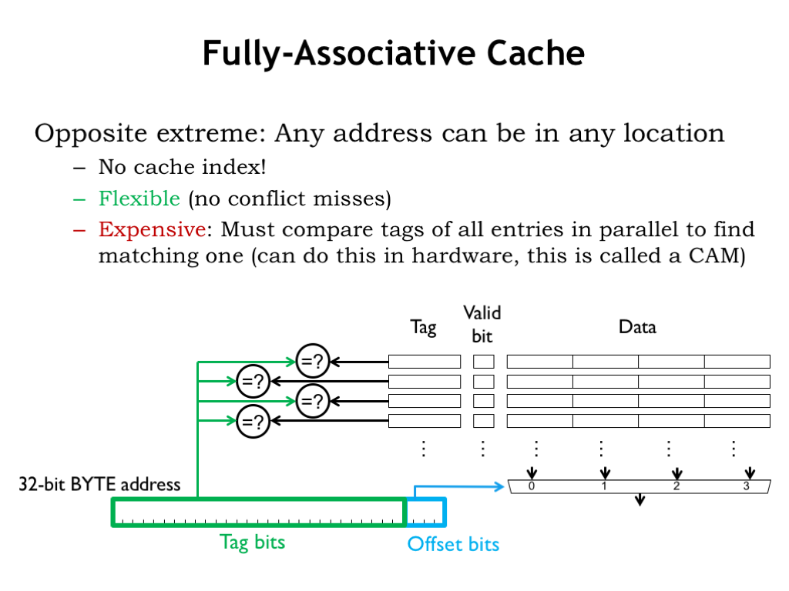
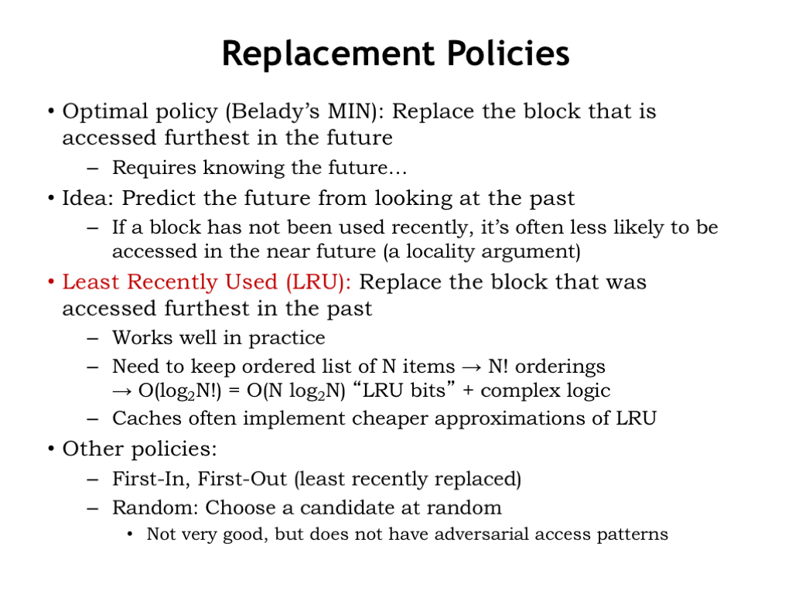

# Associative Caches

A fully-associative (FA) cache has a tag comparator for each cache line. So the tag field of *every* cache line in a FA cache is compared with the tag field of the incoming address. Since all cache lines are searched, a particular memory location can be held in any cache line, which eliminates the problems of address conflicts causing conflict misses. The cache shown here can hold 4 different 4-word blocks, regardless of their address. The example from the end of the previous segment required a cache that could hold two 3-word blocks, one for the instructions in the loop, and one for the data words. This FA cache would use two of its cache lines to perform that task and achieve a 100% hit ratio regardless of the addresses of the instruction and data blocks.

FA caches are very flexible and have high hit ratios for most applications. Their only downside is cost: the inclusion of a tag comparator for each cache line to implement the parallel search for a tag match adds substantially the amount of circuitry required when there are many cache lines. Even the use of hybrid storage/comparison circuitry, called a content-addressable memory, doesn’t make a big dent in the overall cost of a FA cache.

DM caches searched only a single cache line. FA caches search all cache lines. Is there a happy middle ground where some small number of cache lines are searched in parallel?

## Replacement Policies

There’s one final issue to resolve associative caches. When there’s a cache miss, which cache line should be chosen to hold the data that will be fetched from main memory? That’s not an issue with DM caches, since each data block can only be held in one particular cache line, determined by its address. But in N-way SA caches, there are N possible cache lines to choose from, one in each of the ways. And in a FA cache, any of the cache lines can be chosen.

So, how to choose? Our goal is to choose to replace the contents of the cache line which will minimize the impact on the hit ratio in the future.

The optimal choice is to replace the block that is accessed furthest in the future (or perhaps is never accessed again). But that requires knowing the future…

Here’s an idea: let’s predict future accesses by looking at recent accesses and applying the principle of locality. If a block has not been recently accessed, it’s less likely to be accessed in the near future.

That suggests the least-recently-used replacement strategy, usually referred to as LRU: replace the block that was accessed furthest in the past. LRU works well in practice, but requires us to keep a list ordered by last use for each set of cache lines, which would need to be updated on each cache access. When we needed to choose which member of a set to replace, we’d choose the last cache line on this list. For an 8-way SA cache there are 8! possible orderings, so we’d need log2(8!) = 16 state bits to encode the current ordering. The logic to update these state bits on each access isn’t cheap; basically you need a lookup table to map the current 16-bit value to the next 16-bit value. So most caches implement an approximation to LRU where the update function is much simpler to compute.

There are other possible replacement policies: First-in, first-out, where the oldest cache line is replaced regardless of when it was last accessed. And Random, where some sort of pseudo-random number generator is used to select the replacement.

All replacement strategies except for random can be defeated. If you know a cache’s replacement strategy you can design a program that will have an abysmal hit rate by accessing addresses you know the cache just replaced. I’m not sure I care about how well a program designed to get bad performance runs on my system, but the point is that most replacement strategies will occasionally cause a particular program to execute much more slowly than expected.

When all is said and done, an LRU replacement strategy or a close approximation is a reasonable choice.