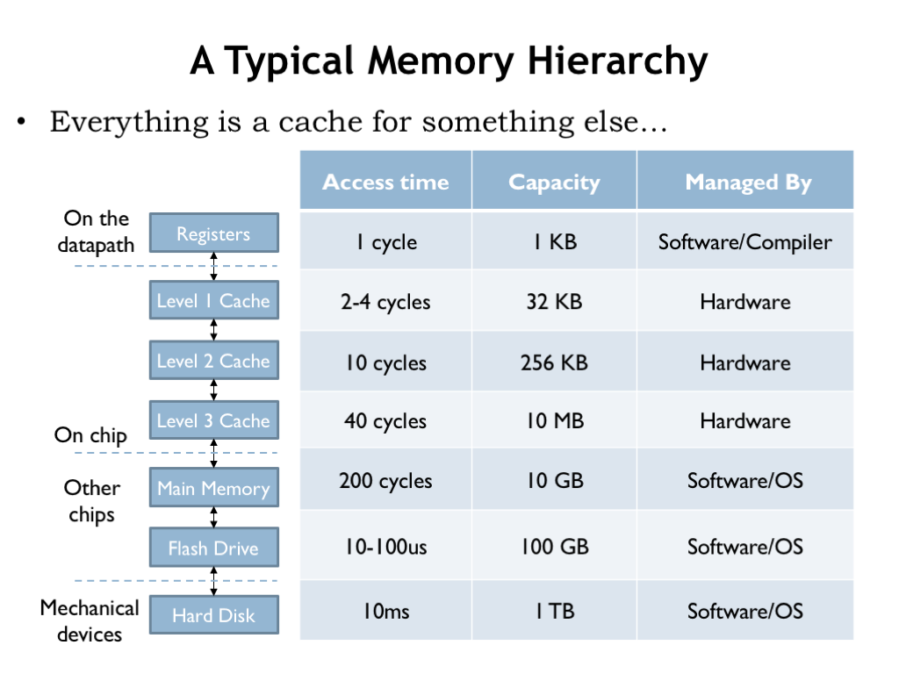
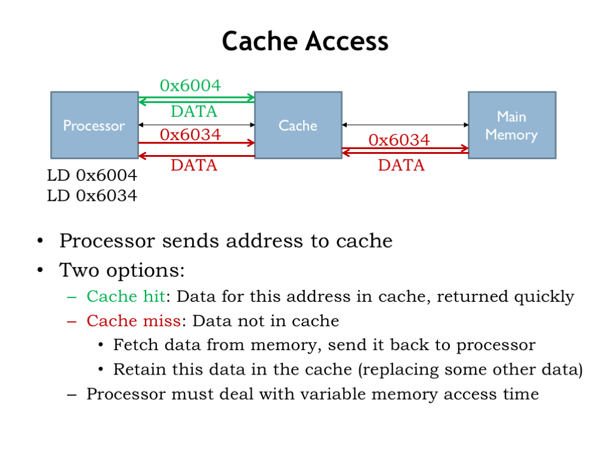
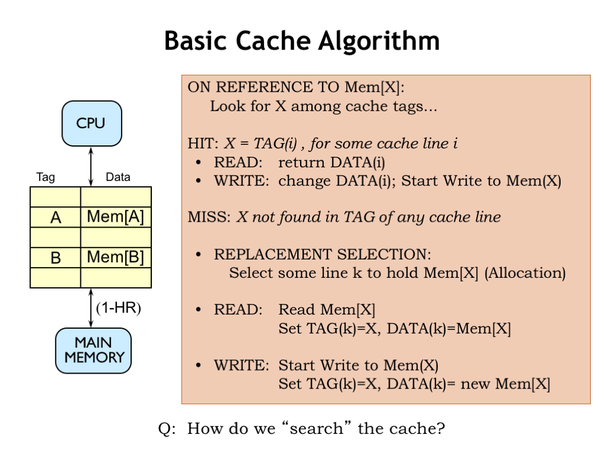

# Caches

The SRAM component of our hierarchical memory system is called a cache. It provides low-latency access to recently-accessed blocks of data. If the requested data is in the cache, we have a cache hit and the data is supplied by the SRAM.

If the requested data is not in the cache, we have a cache miss and a block of data containing the requested location will have to be moved from DRAM into the cache. The locality principle tells us that we should expect cache hits to occur much more frequently than cache misses.

Modern computer systems often use multiple levels of SRAM caches. The levels closest to the CPU are smaller but very fast, while the levels further away from the CPU are larger and hence slower. A miss at one level of the cache generates an access to the next level, and so on until a DRAM access is needed to satisfy the initial request.

Caching is used in many applications to speed up access to frequently-accessed data. For example, your browser maintains a cache of frequently-accessed web pages and uses its local copy of the web page if it determines the data is still valid, avoiding the delay of transferring the data over the Internet.

Here’s an example of a memory hierarchy that might be found on a modern computer. There are three levels of on-chip SRAM caches, followed by DRAM main memory and a flash-memory cache for the hard disk drive. The compiler is responsible for deciding which data values are kept in the CPU registers and which values require the use of LDs and STs. The 3-level cache and accesses to DRAM are managed by circuity in the memory system. After that the access times are long enough (many hundreds of instruction times) that the job of managing the movement of data between the lower levels of the hierarchy is turned over to software.

Whether managed by hardware or software, each layer of the memory system is designed to provide lower-latency access to frequently-accessed locations in the next, slower layer. But, as we’ll see, the implementation strategies will be quite different in the slower layers of the hierarchy.

The processor starts an access by sending an address to the cache. If data for the requested address is held in the cache, it’s quickly returned to the CPU.

If the data we request is not in the cache, we have a cache miss, so the cache has to make a request to main memory to get the data, which it then returns to processor. Typically the cache will remember the newly fetched data, possibly replacing some older data in the cache.

Suppose a cache access takes 4 ns and a main memory access takes 40 ns. Then an access that hits in the cache has a latency of 4 ns, but an access that misses in the cache has a latency of 44 ns. The processor has to deal with the variable memory access time, perhaps by simply waiting for the access to complete, or, in modern hyper-threaded processors, it might execute an instruction or two from another programming thread.

## Basic Cache Algorithm

Here’s a start at building a cache. The cache will hold many different blocks of data; for now let’s assume each block is an individual memory location. Each data block is tagged with its address. A combination of a data block and its associated address tag is called a cache line.

When an address is received from the CPU, we’ll search the cache looking for a block with a matching address tag. If we find a matching address tag, we have a cache hit. On a read access, we’ll return the data from the matching cache line. On a write access, we’ll update the data stored in the cache line and, at some point, update the corresponding location in main memory.

If no matching tag is found, we have a cache miss. So we’ll have to choose a cache line to use to hold the requested data, which means that some previously cached location will no longer be found in the cache. For a read operation, we’ll fetch the requested data from main memory, add it to the cache (updating the tag and data fields of the cache line) and, of course, return the data to the CPU. On a write, we’ll update the tag and data in the selected cache line and, at some point, update the corresponding location in main memory.

So the contents of the cache are determined by the memory requests made by the CPU. If the CPU requests a recently-used address, chances are good the data will still be in the cache from the previous access to the same location. As the working set slowly changes, the cache contents will be updated as needed. If the entire working set can fit into the cache, most of the requests will be hits and the AMAT will be close to the cache access time. So far, so good!

Of course, we’ll need to figure how to quickly search the cache, i.e., we’ll a need fast way to answer the question of whether a particular address tag can be found in some cache line. That’s our next topic.