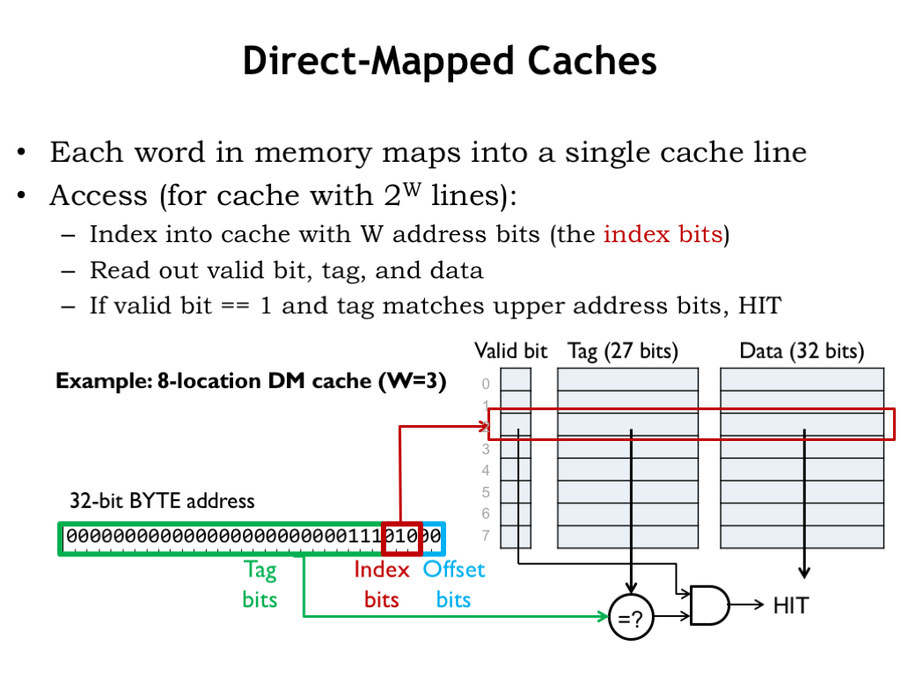
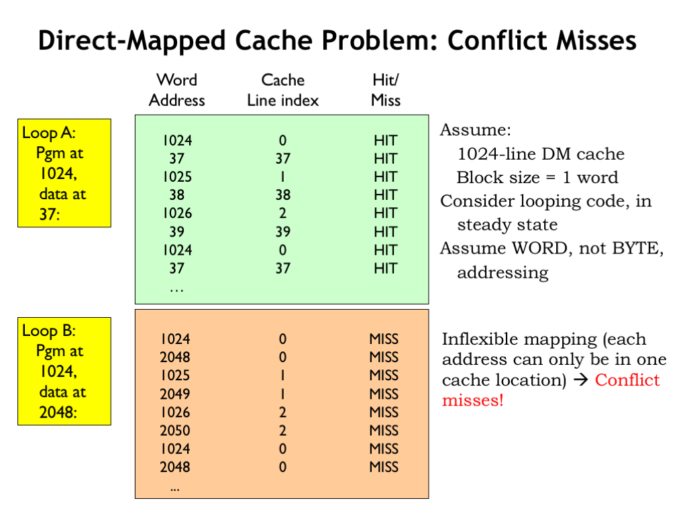

# Direct-Mapped Caches

The simplest cache hardware consists of an SRAM with a few additional pieces of logic. The cache hardware is designed so that each memory location in the CPU’s address space maps to a particular cache line, hence the name direct-mapped (DM) cache. There are, of course, many more memory locations then there are cache lines, so many addresses are mapped to the same cache line and the cache will only be able to hold the data for one of those addresses at a time.

The operation of a DM cache is straightforward. We’ll use part of the incoming address as an index to select a single cache line to be searched. The search consists of comparing the rest of the incoming address with the address tag of the selected cache line. If the tag matches the address, there’s a cache hit and we can immediately use the data in the cache to satisfy the request.

In this design, we’ve included an additional valid bit which is 1 when the tag and data fields hold valid information. The valid bit for each cache line is initialized to 0 when the cache is powered on, indicating that all cache lines are empty. As data is brought into the cache, the valid bit is set to 1 when the cache line’s tag and data fields are filled. The CPU can request that the valid bit be cleared for a particular cache line — this is called flushing the cache. If, for example, the CPU initiates a read from disk, the disk hardware will read its data into a block of main memory, so any cached values for that block will be out-of-date. So the CPU will flush those locations from the cache by marking any matching cache lines as invalid.

Let’s see how this works using a small DM cache with 8 lines where each cache line contains a single word (4 bytes) of data. Here’s a CPU request for the location at byte address 0xE8. Since there 4 bytes of data in each cache line, the bottom 2 address bits indicate the appropriate byte offset into the cached word. Since the cache deals only with word accesses, the byte offset bits aren’t used.

Next, we’ll need to use 3 address bits to select which of the 8 cache lines to search. We choose these cache index bits from the low-order bits of the address. Why? Well, it’s because of locality. The principle of locality tells us that it’s likely that the CPU will be requesting nearby addresses and for the cache to perform well, we’d like to arrange for nearby locations to be able to be held in the cache at the same time. This means that nearby locations will have to be mapped to different cache lines. The addresses of nearby locations differ in their low-order address bits, so we’ll use those bits as the cache index bits — that way nearby locations will map to different cache lines.

The data, tag and valid bits selected by the cache line index are read from the SRAM. To complete the search, we check the remaining address against the tag field of the cache. If they’re equal and the valid bit is 1, we have a cache hit, and the data field can be used to satisfy the request.

How come the tag field isn’t 32 bits, since we have a 32-bit address? We could have done that, but since all values stored in cache line 2 will have the same index bits (0b010), we saved a few bits of SRAM and chose not save those bits in the tag. In other words, there’s no point in using SRAM to save bits we can generate from the incoming address.

So the cache hardware in this example is an 8-location by 60 bit SRAM plus a 27-bit comparator and a single AND gate. The cache access time is the access time of the SRAM plus the propagation delays of the comparator and AND gate. About as simple and fast as we could hope for.

The downside of the simplicity is that for each CPU request, we’re only looking in a single cache location to see if the cache holds the desired data. Not much of search is it? But the mapping of addresses to cache lines helps us out here. Using the low-order address bit as the cache index, we’ve arranged for nearby locations to be mapped to different cache lines. So, for example, if the CPU were executing an 8-instruction loop, all 8 instructions can be held in the cache at the same time. A more complicated search mechanism couldn’t improve on that. The bottom line: this extremely simple search is sufficient to get good cache hit ratios for the cases we care about.

## Conflict Misses

DM caches do have an Achilles heel. Consider running the 3-instruction LOOPA code with the instructions located starting at word address 1024 and the data starting at word address 37 where the program is making alternating accesses to instruction and data, e.g., a loop of LD instructions.

Assuming a 1024-line DM cache with a block size of 1, the steady state hit ratio will be 100% once all six locations have been loaded into the cache since each location is mapped to a different cache line.

Now consider the execution of the same program, but this time the data has been relocated to start at word address 2048. Now the instructions and data are competing for use of the same cache lines. For example, the first instruction (at address 1024) and the first data word (at address 2048) both map to cache line 0, so only one them can be in the cache at a time. So fetching the first instruction fills cache line 0 with the contents of location 1024, but then the first data access misses and then refills cache line 0 with the contents of location 2048. The data address is said to conflict with the instruction address. The next time through the loop, the first instruction will no longer be in the cache and its fetch will cause a cache miss, called a conflict miss. So in the steady state, the cache will never contain the word requested by the CPU.

This is very unfortunate! We were hoping to design a memory system that offered the simple abstraction of a flat, uniform address space. But in this example we see that simply changing a few addresses results in the cache hit ratio dropping from 100% to 0%. The programmer will certainly notice her program running 10 times slower!

So while we like the simplicity of DM caches, we’ll need to make some architectural changes to avoid the performance problems caused by conflict misses.

