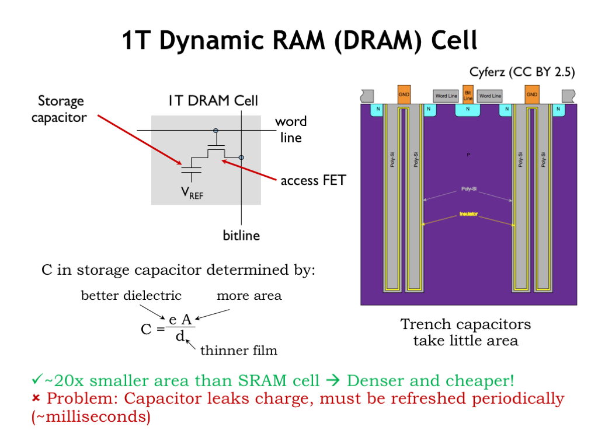

# DRAM

The SRAM uses 6 MOSFETs for each bit cell. Can we do better? What’s the minimum number of MOSFETs needed to store a single bit of information? 

> NOTE: A MOSFET (Metal-Oxide-Semiconductor Field-Effect Transistor) cell is a type of transistor used for amplifying or switching electronic signals.. It consists of a gate, source, and drain terminals; the gate terminal controls the conductivity between the source and drain by applying a voltage, which modulates the current flow. MOSFETs are fundamental components in integrated circuits, widely used in digital and analog circuits due to their high efficiency and fast switching speeds.

Well, we’ll need at least one MOSFET so we can select which bits will be affected by read and write operations. We can use a simple capacitor for storage, where the value of a stored bit is represented by voltage across the plates of the capacitor. The resulting circuit is termed a dynamic random-access memory (DRAM) cell.

If the capacitor voltage exceeds a certain threshold, we’re storing a 1 bit, otherwise we’re storing a 0. The amount of charge on the capacitor, which determines the speed and reliability of reading the stored value, is proportional to the capacitance. We can increase the capacitance by increasing the dielectric constant of the insulating material between the two plates of the capacitor, increasing the area of the plates, or by decreasing the the distance between the plates. All of these are constantly being improved.

A cross section of a modern DRAM cell is shown here. The capacitor is formed in a large trench dug into the substrate material of the integrated circuit. Increasing the depth of the trench will increase the area of the capacitor plates without increasing the cell’s area. A very thin insulating layer separates the outer plate from the inner plate, which is connected to some reference voltage (shown as GND in this diagram).All

**All this is to say that the resulting circuit is quite compact: about 20-times less area/bit than an SRAM bit cell**. There are some challenges however. There’s no circuitry to manage the static charge on the capacitor, so stored charge will leak from the outer plate of the capacitor, hence the name dynamic memory. This limits the amount of time we can leave the capacitor unattended and still expect to read the stored value. This means we’ll have to arrange to read then re-write each bit cell (called a refresh cycle) every 10ms or so, adding to the complexity of the DRAM interface circuitry.

This video provides details about how we read from and write to DRAM:

<iframe width="560" height="315" src="https://www.youtube.com/embed/9eWKuWyXYKY?si=egyDf4SNRjwE6FMs&amp;start=141" title="YouTube video player" frameborder="0" allow="accelerometer; autoplay; clipboard-write; encrypted-media; gyroscope; picture-in-picture; web-share" allowfullscreen></iframe>

> **Check Your Understanding**: Some new terms were probably used in the explanation of what makes up DRAM and how it is used.  On a piece of paper list out those terms and spend a few minutes doing independent researching using Google or ChatGPT to gain a better understanding of those terms.

In summary, DRAM bit cells consist of a single access FET connected to a storage capacitor that’s cleverly constructed to take up as little area as possible. DRAMs must rewrite the contents of bit cells after they are read and every cell must be read and written periodically to ensure that the stored charge is refreshed before it’s corrupted by leakage currents.

DRAMs have much higher capacities than SRAMs because of the small size of the DRAM bit cells, but the complexity of the DRAM interface circuitry means that the initial access to a row of locations is quite a bit slower than an SRAM access. However subsequent accesses to the same row happen at speeds close to that of SRAM accesses.

Both SRAMs and DRAMs will store values as long as their circuitry has power. But if the circuitry is powered down, the stored bits will be lost. For long-term storage we will need to use non-volatile memory technologies, the topic of the next lecture segment.
