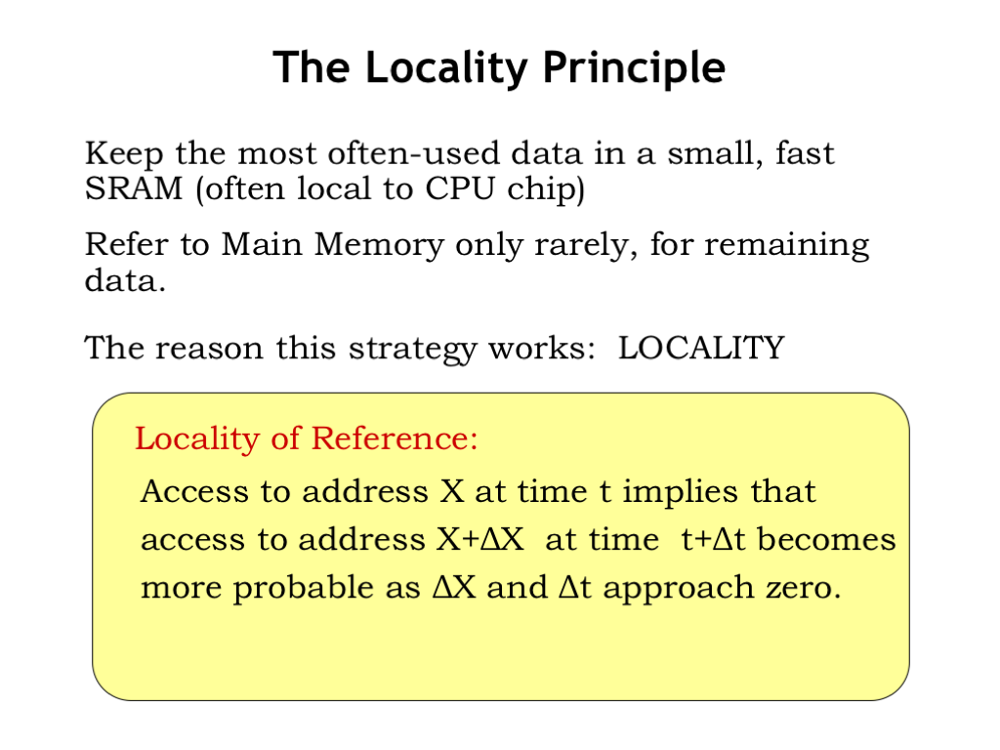
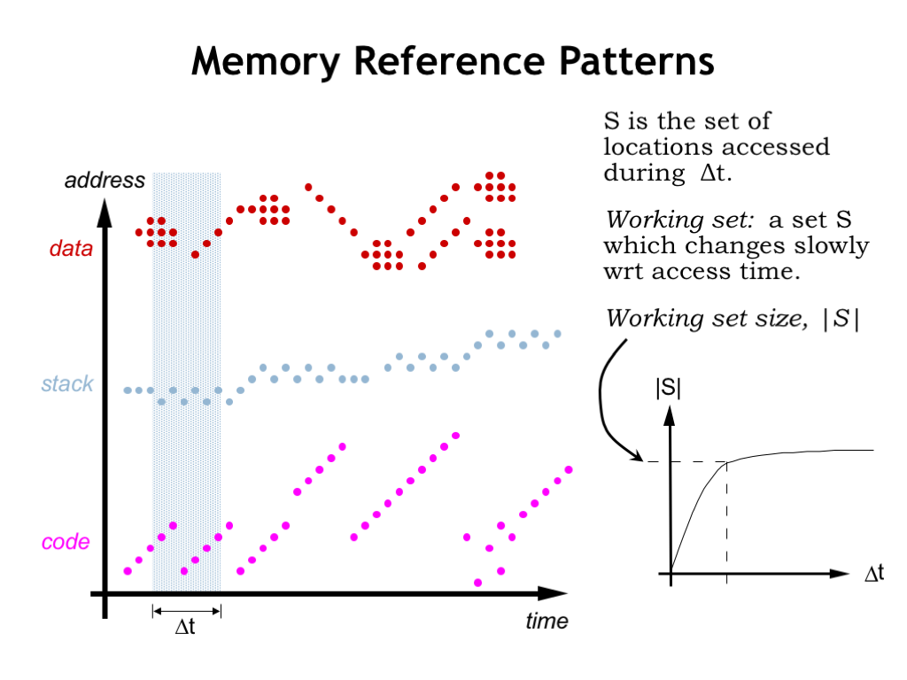

# The Locality Principle

It turns out that when running general-purpose programs, it is possible to build an automatically managed, low-latency, high-capacity hierarchical memory system that appears as one large, uniform memory. What’s the insight that makes this possible? That’s the topic of the next section.

So, how can the memory system arrange for the right data to be in the right place at the right time? Our goal is to have the frequently-used data in some fast SRAM. That means the memory system will have to be able to predict which memory locations will be accessed. And to keep the overhead of moving data into and out of SRAM manageable, we’d like to amortize the cost of the move over many accesses. In other words we want any block of data we move into SRAM to be accessed many times.

When not in SRAM, data would live in the larger, slower DRAM that serves as main memory. If the system is working as planned, DRAM accesses would happen infrequently, e.g., only when it’s time to bring another block of data into SRAM.

If we look at how programs access memory, it turns out we *can* make accurate predictions about which memory locations will be accessed. The guiding principle is locality of reference which tells us that if there’s an access to address X at time t, it’s very probable that the program will access a nearby location in the near future.

To understand why programs exhibit locality of reference, let’s look at how a running program accesses memory.

Instruction fetches are quite predictable. Execution usually proceeds sequentially since most of the time the next instruction is fetched from the location after that of the current instruction. Code that loops will repeatedly fetch the same sequence of instructions, as shown here on the left of the time line. There will of course be branches and subroutine calls that interrupt sequential execution, but then we’re back to fetching instructions from consecutive locations. Some programming constructs, e.g., method dispatch in object-oriented languages, can produce scattered references to very short code sequences (as shown on the right of the time line) but order is quickly restored.

This agrees with our intuition about program execution. For example, once we execute the first instruction of a procedure, we’ll almost certainly execute the remaining instructions in the procedure. So if we arranged for all the code of a procedure to moved to SRAM when the procedure’s first instruction was fetched, we’d expect that many subsequent instruction fetches could be satisfied by the SRAM. And although fetching the first word of a block from DRAM has relatively long latency, the DRAM’s fast column accesses will quickly stream the remaining words from sequential addresses. This will amortize the cost of the initial access over the whole sequence of transfers.

The story is similar for accesses by a procedure to its arguments and local variables in the current stack frame. Again there will be many accesses to a small region of memory during the span of time we’re executing the procedure’s code.

Data accesses generated by LD and ST instructions also exhibit locality. The program may be accessing the components of an object or struct. Or it may be stepping through the elements of an array. Sometimes information is moved from one array or data object to another, as shown by the data accesses on the right of the timeline.

Using simulations we can estimate the number of different locations that will be accessed over a particular span of time. What we discover when we do this is the notion of a working set of locations that are accessed repeatedly. If we plot the size of the working set as a function of the size of the time interval, we see that the size of the working set levels off. In other words once the time interval reaches a certain size the number of locations accessed is approximately the same independent of when in time the interval occurs.

As we see in our plot to the left, the actual addresses accessed will change, but the number of *different* addresses during the time interval will, on the average, remain relatively constant and, surprisingly, not all that large!

This means that if we can arrange for our SRAM to be large enough to hold the working set of the program, most accesses will be able to be satisfied by the SRAM. We’ll occasionally have to move new data into the SRAM and old data back to DRAM, but the DRAM access will occur less frequently than SRAM accesses.You can see that thanks to locality of reference **we’re on track to build a memory out of a combination of SRAM and DRAM that performs like an SRAM but has the capacity of the DRAM.**

