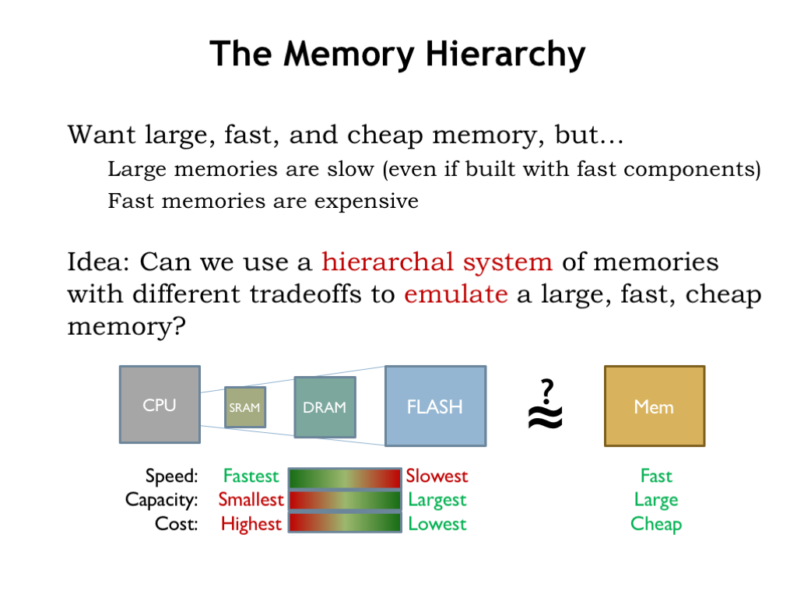
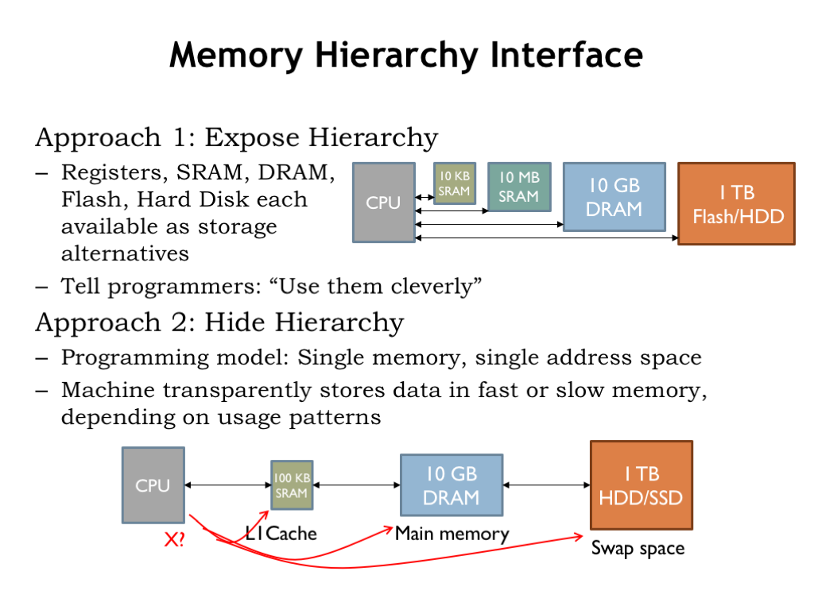

# The Memory Hierarchy

Each transition in memory hierarchy shows the same fundamental design choice: we can pick smaller-and-faster or larger-and-slower. This is a bit awkward actually — can we figure how to get the best of both worlds?

We want our system to behave as if it had a large, fast, and cheap main memory. Clearly we can’t achieve this goal using any single memory technology.

Here’s an idea: can we use a hierarchical system of memories with different tradeoffs to achieve close to the same results as a large, fast, cheap memory? Could we arrange for memory locations we’re using often to be stored, say, in SRAM and have those accesses be low latency? Could the rest of the data could be stored in the larger and slower memory components, moving the between the levels when necessary? Let’s follow this train of thought and see where it leads us.

There are two approaches we might take. The first is to expose the hierarchy, providing some amount of each type of storage and let the programmer decide how best to allocate the various memory resources for each particular computation. The programmer would write code that moved data into fast storage when appropriate, then back to the larger and slower memories when low-latency access was no longer required. There would only be a small amount of the fastest memory, so data would be constantly in motion as the focus of the computation changed.

This approach has had notable advocates. Perhaps the most influential was Seymour Cray, the “Steve Jobs” of supercomputers. Cray was the architect of the world’s fastest computers in each of three decades, inventing many of the technologies that form the foundation of high-performance computing. His insight to managing the memory hierarchy was to organize data as vectors and move vectors in and out of fast memory under program control. This was actually a good data abstraction for certain types of scientific computing and his vector machines had the top computing benchmarks for many years.

The second alternative is to hide the hierarchy and simply tell the programmer they have a large, uniform address space to use as they wish. The memory system would, behind the scenes, move data between the various levels of the memory hierarchy, depending on the usage patterns it detected. This would require circuitry to examine each memory access issued by the CPU to determine where in the hierarchy to find the requested location. And then, if a particular region of addresses was frequently accessed — say, when fetching instructions in a loop — the memory system would arrange for those accesses to be mapped to the fastest memory component and automatically move the loop instructions there. All of this machinery would be transparent to the programmer: the program would simply fetch instructions and access data and the memory system would handle the rest.

Could the memory system automatically arrange for the right data to be in the right place at the right time? Cray was deeply skeptical of this approach. He famously quipped “that you can’t fake what you haven’t got”. Wouldn’t the programmer, with her knowledge of how data was going to be used by a particular program, be able to do a better job by explicitly managing the memory hierarchy?