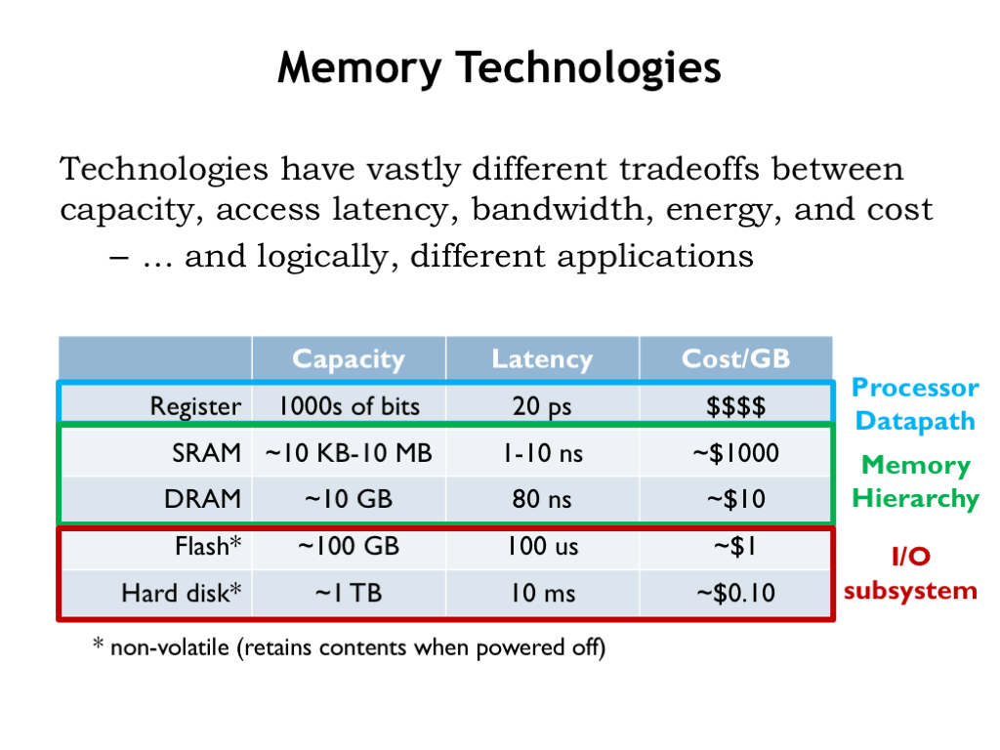

# Memory Technologies

In past weeks we completed the design of a very simple microprocessor and learned about the overall architecture of a much more complicated microprocessor.  One of the major limitations of our microprocessor is that it didn't interact with memory in any way.  However, we know that the execution of every instructions starts by fetching the instruction from main memory.  And ultimately all the data processed by the CPU is loaded from or stored to main memory. A very few frequently-used variable values can be kept in the CPU’s register file, but most interesting programs manipulate *much* more data than can be accommodated by the storage available as part of the CPU datapath.

In fact, the performance of most modern computers is limited by the bandwidth, i.e., bytes/second, of the connection between the CPU and main memory, the so-called *memory bottleneck*. The goal of this module is to understand the nature of the bottleneck and to see if there are architectural improvements we might make to minimize the problem as much as possible.

We have a number of memory technologies at our disposal, varying widely in their capacity, latency, bandwidth, energy efficiency and their cost. Not surprisingly, we find that each is useful for different applications in our overall system architecture.

Our registers are built from sequential logic and provide very low latency access (20ps or so) to at most a few thousands of bits of data. Static and dynamic memories, which we’ll discuss further, offer larger capacities at the cost of longer access latencies. Static random-access memories (SRAMs) are designed to provide low latencies (a few nanoseconds at most) to many thousands of locations. Already we see that more locations means longer access latencies — this is a fundamental size vs. performance tradeoff of our current memory architectures. The tradeoff comes about because increasing the number of bits will increase the area needed for the memory circuitry, which will in turn lead to longer signal lines and slower circuit performance due to increased capacitive loads.

Dynamic random-access memories (DRAMs) are optimized for capacity and low cost, sacrificing access latency. As we’ll see, we can use both SRAMs and DRAMs to build a hybrid memory hierarchy that provides low average latency and high capacity — an attempt to get the best of both worlds!

Notice that the word “average” has snuck into the performance claims. This means that we’ll be relying on statistical properties of memory accesses to achieve our goals of low latency and high capacity. In the worst case, we’ll still be stuck with the capacity limitations of SRAMs and the long latencies of DRAMs, but we’ll work hard to ensure that the worst case occurs infrequently!

Flash memory and hard-disk drives provide non-volatile storage. Non-volatile means that the memory contents are preserved even when the power is turned off. Hard disks are at the bottom of the memory hierarchy, providing massive amounts of long-term storage for very little cost. Flash memories, with a 100-fold improvement in access latency, are often used in concert with hard-disk drives in the same way that SRAMs are used in concert with DRAMs, i.e., to provide a hybrid system for non-volatile storage that has improved latency *and* high capacity.

Let’s learn a bit more about each of these four memory technologies, then we’ll return to the job of building our memory system.
