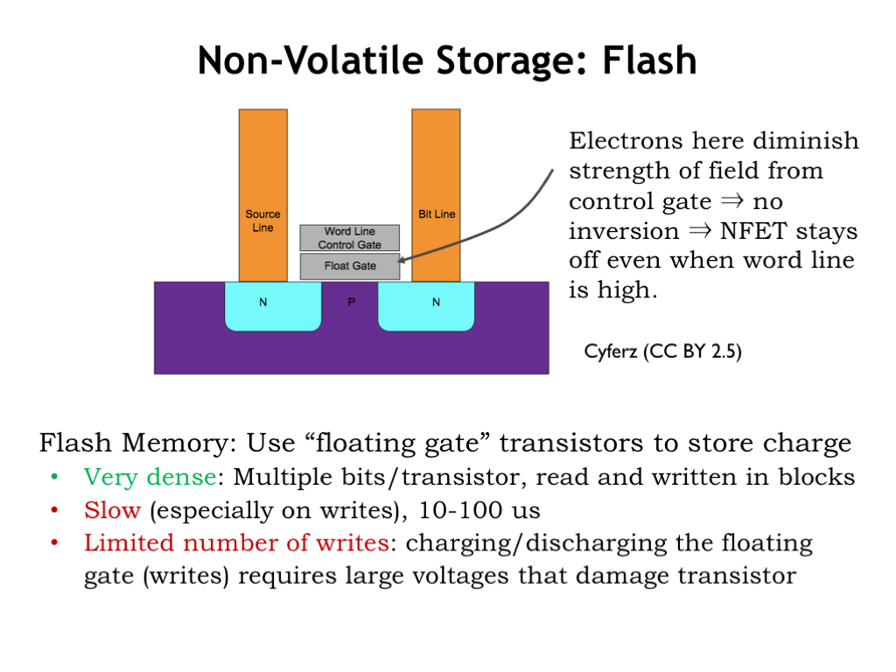
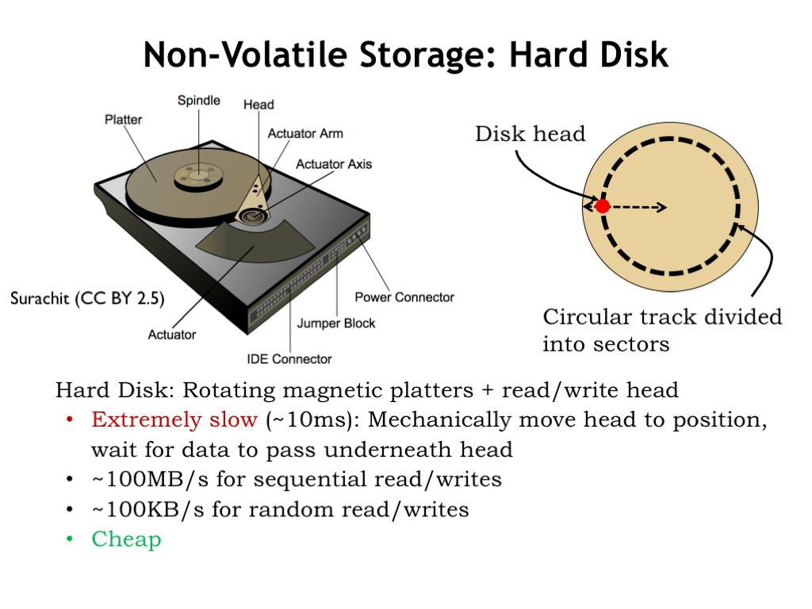

# Non-volatile Storage

Non-volatile memories are used to maintain system state even when the system is powered down.

## Flash Memory

One example of non-volatile memory is flash memory.  In flash memories, long-term storage is achieved by storing charge on an well-insulated conductor called a floating gate, where it will remain stable for years. The floating gate is incorporated in a standard MOSFET, placed between the MOSFET’s gate and the MOSFET’s channel. If there is no charge stored on the floating gate, the MOSFET can be turned on, i.e., be made to conduct, by placing a voltage on the gate terminal, creating an inversion layer that connects the MOSFET’s source and drain terminals. If there is a charge stored on the floating gate, a higher voltage is required to turn on the MOSFET. By setting the gate terminal to a voltage between and , we can determine if the floating gate is charged by testing to see if the MOSFET is conducting.

In fact, if we can measure the current flowing through the MOSFET, we can determine how much charge is stored on the floating gate, making it possible to store multiple bits of information in one flash cell by varying the amount of charge on its floating gate. Flash cells can be connected in parallel or series to form circuits resembling CMOS NOR or NAND gates, allowing for a variety of access architectures suitable for either random or sequential access.

Flash memories are very dense, approaching the areal density of DRAMs, particularly when each cell holds multiple bits of information.

Read access times for NOR flash memories are similar to that of DRAMs, several tens of nanoseconds. Read times for NAND flash memories are much longer, on the order of 10 microseconds. Write times for all types of flash memories are quite long since high voltages have to be used to force electrons to cross the insulating barrier surrounding the floating gate.

Flash memories can only be written some number of times before the insulating layer is damaged to the point that the floating gate will no longer reliably store charge. Currently the number of guaranteed writes varies between 100,000 and 1,000,000. To work around this limitation, flash chips contain clever address mapping algorithms so that writes to the same address actually are mapped to different flash cells on each successive write.

The bottom line is that flash memories are a higher-performance but higher-cost replacement for the hard-disk drive, the long-time technology of choice for non-volatile storage.

## Hard Disk Drives (HDDs)

A hard-disk drive (HDD) contains one or more rotating platters coated with a magnetic material. The platters rotate at speeds ranging from 5400 to 15000 RPM. A read/write head positioned above the surface of a platter can detect or change the orientation of the magnetization of the magnetic material below. The read/write head is mounted on an actuator that allows it to be positioned over different circular tracks.

To read a particular sector of data, the head must be positioned radially over the correct track, then wait for the platter to rotate until it’s over the desired sector. The average total time required to correctly position the head is on the order of 10 milliseconds, so hard disk access times are quite long.

However, once the read/write head is in the correct position, data can be transferred at the respectable rate of 100 megabytes/second. If the head has to be repositioned between each access, the effective transfer rate drops 1000-fold, limited by the time it takes to reposition the head.

Hard disk drives provide cost-effective non-volatile storage for terabytes of data, albeit at the cost of slow access times.

## Summary

This completes our whirlwind tour of memory technologies. If you’d like to learn a bit more, Wikipedia has useful articles on each type of device. SRAM sizes and access times have kept pace with the improvements in the size and speed of integrated circuits. Interestingly, although capacities and transfer rates for DRAMs and HDDs have improved, their initial access times have not improved nearly as rapidly. Thankfully over the past decade flash memories have helped to fill the performance gap between processor speeds and HDDs. But the gap between processor cycle times and DRAM access times has continued to widen, increasing the challenge of designing low-latency high-capacity memory systems.

The capacity of the available memory technologies varies over 10 orders of magnitude, and the variation in latencies varies over 8 orders of magnitude. This creates a considerable challenge in figuring out how to navigate the speed vs. size tradeoffs.