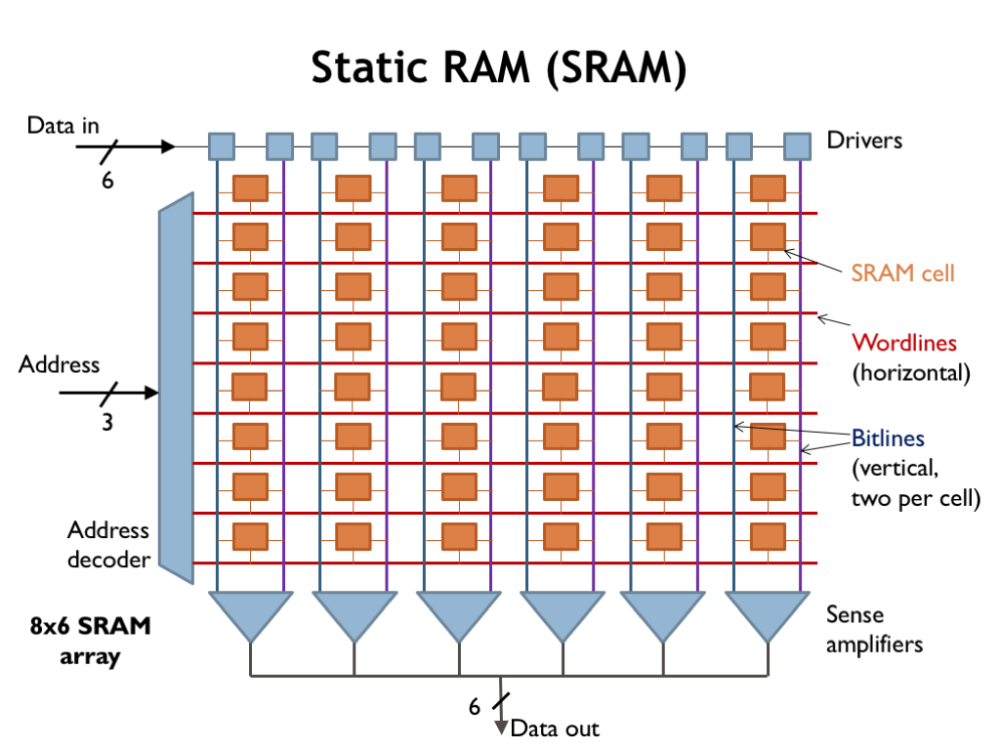

# Static RAM

Static RAMs (SRAMs) are organized as an array of memory locations, where a memory access is either reading or writing all the bits in a single location. Here we see the component layout for a 8-location SRAM array where each location holds 6 bits of data. You can see that the individual bit cells are organized as 8 rows (one row per location) by 6 columns (one column per bit in each memory word). The circuitry around the periphery is used to decode addresses and support read and write operations.

To access the SRAM, we need to provide enough address bits to uniquely specify the location. In this case we need 3 address bits to select one of the 8 memory locations. The address decoder logic sets one of the 8 wordlines (the horizontal wires in the array) high to enable a particular row (location) for the upcoming access. The remaining wordlines are set low, disabling the cells they control. The active wordline enables each of the SRAM bit cells on the selected row, connecting each cell to a pair of bit lines (the vertical wires in the array). During read operations the bit lines carry the analog signals from the enabled bit cells to the sense amplifiers, which convert the analog signals to digital data. During write operations incoming data is driven onto the bit lines to be stored into the enabled bit cells.

Larger SRAMs will have a more complex organization in order to minimize the length, and hence the capacitance, of the bit lines.

This video provides details about how we read from and write to SRAM:

<iframe width="560" height="315" src="https://www.youtube.com/embed/GBL28_Tw6UQ?si=K2UjeS6fl82Xtms2" title="YouTube video player" frameborder="0" allow="accelerometer; autoplay; clipboard-write; encrypted-media; gyroscope; picture-in-picture; web-share" allowfullscreen></iframe>

In summary, the circuitry for the SRAM is organized as an array of bit cells, with one row for each memory location and one column for each bit in a location. Each bit is stored by two inverters connected to form a bistable storage element. Reads and writes are essentially analog operations performed via the bitlines and access FETs.