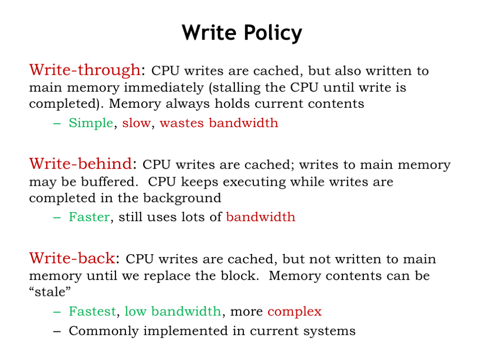
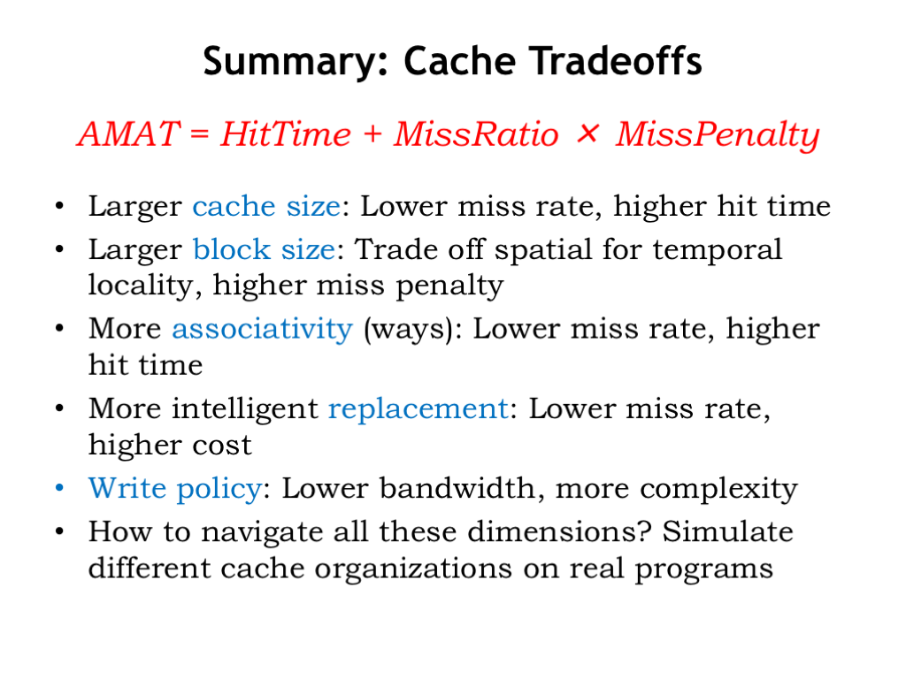

# Write Strategies

Okay, one more cache design decision to make, then we’re done!

How should we handle memory writes in the cache? Ultimately we’ll need update main memory with the new data, but when should that happen?

The most obvious choice is to perform the write immediately. In other words, whenever the CPU sends a write request to the cache, the cache then performs the same write to main memory. This is called write-through. That way main memory always has the most up-to-date value for all locations. But this can be slow if the CPU has to wait for a DRAM write access — writes could become a real bottleneck! And what if the program is constantly writing a particular memory location, e.g., updating the value of a local variable in the current stack frame? In the end we only need to write the last value to main memory. Writing all the earlier values is waste of memory bandwidth.

Suppose we let the CPU continue execution while the cache waits for the write to main memory to complete — this is called write-behind. This will overlap execution of the program with the slow writes to main memory. Of course, if there’s another cache miss while the write is still pending, everything will have to wait at that point until both the write and subsequent refill read finish, since the CPU can’t proceed until the cache miss is resolved.

The best strategy is called write-back where the contents of the cache are updated and the CPU continues execution immediately. The updated cache value is only written to main memory when the cache line is chosen as the replacement line for a cache miss. This strategy minimizes the number of accesses to main memory, preserving the memory bandwidth for other operations. This is the strategy used by most modern processors.

## Conclusion

That concludes our discussion of caches, which was motivated by our desire to minimize the average memory access time by building a hierarchical memory system that had both low latency and high capacity.

There were a number of strategies we employed to achieve our goal.

Increasing the number of cache lines decreases AMAT by decreasing the miss ratio.

Increasing the block size of the cache let us take advantage of the fast column accesses in a DRAM to efficiently load a whole block of data on a cache miss. The expectation was that this would improve AMAT by increasing the number of hits in the future as accesses were made to nearby locations.

Increasing the number of ways in the cache reduced the possibility of cache line conflicts, lowering the miss ratio.

Choosing the least-recently used cache line for replacement minimized the impact of replacement on the hit ratio.

And, finally, we chose to handle writes using a write-back strategy with dirty bits.

How do we make the tradeoffs among all these architectural choices? As usual, we simulate different cache organizations and chose the architectural mix that provides the best performance on our benchmark programs.
