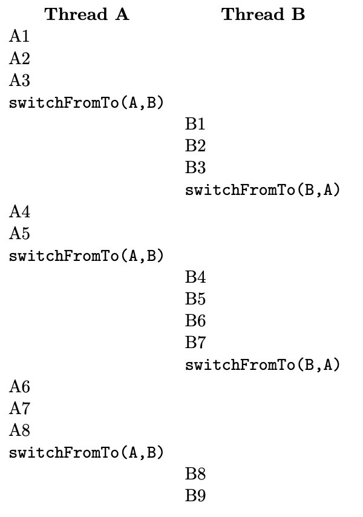
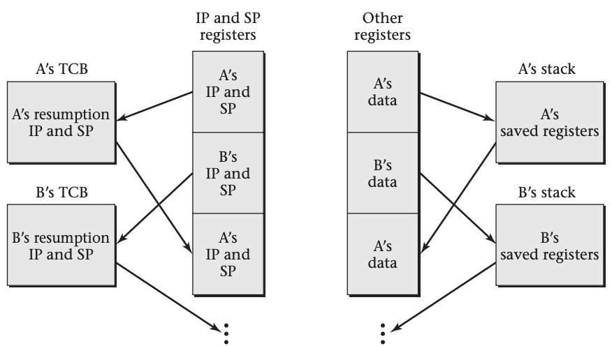

# Context Switching

In order for the operating system to have more than one thread underway on a processor, the system needs to have some
mechanism for switching attention between threads. In particular, there needs to be some way to leave off from in the
middle of a thread’s sequence of instructions, work for a while on other threads, and then pick back up in the original
thread right where it left off. In order to explain this context switching as simply as possible, I will initially assume that
each thread is executing code that contains, every once in a while, explicit instructions to temporarily switch to
another thread. Once you understand this mechanism, I can then build on it for the more realistic case where the thread
contains no explicit thread-switching points, but rather is automatically interrupted for thread switches.

> Thread switching is often called *context switching*, because it switches from the execution context of one thread to
that of another thread. Many authors, however, use the phrase context switching differently, to refer to switching
processes with their protection contexts. If the distinction matters, the clearest choice is to avoid the ambiguous term
*context switching* and use the more specific *thread switching* or *process switching*

## Example

Suppose we have two threads, *A* and *B*, and we use *A1*, *A2*, *A3*, and so forth as names for the instruction execution steps
that constitute *A*, and similarly for *B*. In this case, one possible execution sequence might be as shown below.
As I will explain subsequently, when thread *A* executes `switchFromTo(A, B)` the computer starts executing instructions from
thread *B*. In a more realistic example, there might be more than two threads, and each might run for many more steps
(both between switches and overall), with only occasionally a new thread starting or an existing thread exiting.



Our goal is that the steps of each thread form a coherent execution sequence. That is, from the perspective of thread *A*,
its execution should not be much different from one in which *A1* through *A8* occurred consecutively, without interruption,
and similarly for thread *B*’s steps *B1* through *B9*. Suppose, for example, steps *A1* and *A2* load two values from memory into
registers, *A3* adds them, placing the sum in a register, and *A4* doubles that register’s contents, so as to get twice the
sum. In this case, we want to make sure that *A4* really does double the sum computed by *A1* through *A3*, rather than
doubling some other value that thread *B*’s steps *B1* through *B3* happen to store in the same register. Thus, we can see
that switching threads cannot simply be a matter of a jump instruction transferring control to the appropriate
instruction in the other thread. At a minimum, we will also have to save registers into memory and restore them from
there, so that when a thread resumes execution, its own values will be back in the registers.

## Basic Case

In order to focus on the essentials, let’s put aside the issue of how threads start and exit. Instead, let’s focus just
on the normal case where one thread in progress puts itself on hold and switches to another thread where that other
thread last left off, such as the switch from *A5* to *B4* in the preceding example. To support switching threads, the
operating system will need to keep information about each thread, such as at what point that thread should resume
execution. If this information is stored in a block of memory for each thread, then we can use the addresses of those
memory areas to refer to the threads. The block of memory containing information about a thread is called a *thread
control block* or *task control block* (TCB). Thus, another way of saying that we use the addresses of these blocks is to
say that we use pointers to thread control blocks to refer to threads.

Our fundamental thread-switching mechanism will be the `switchFromTo` procedure, which takes two of these thread control
block pointers as parameters: one specifying the thread that is being switched out of, and one specifying the next
thread, which is being switched into. In our running example, *A* and *B* are pointer variables pointing to the two threads’
control blocks, which we use alternately in the roles of outgoing thread and next thread. For example, the program for
thread *A* contains code after instruction *A5* to switch from *A* to *B*, and the program for thread *B* contains code after
instruction *B3* to switch from *B* to *A*. Of course, this assumes that each thread knows both its own identity and the
identity of the thread to switch to. Later, we will see how this unrealistic assumption can be eliminated. For now,
though, let’s see how we could write the `switchFromTo` procedure so that `switchFromTo(A, B)` would save the current
execution status information into the structure pointed to by *A*, read back previously saved information from the
structure pointed to by *B*, and resume where thread *B* left off.

We already saw that the execution status information to save includes not only a position in the program, often called
the *program counter* (PC) or *instruction pointer* (IP), but also the contents of registers. Another critical part of the
execution status for programs compiled with most higher level language compilers is a portion of the memory used to
store a stack, along with a stack pointer register that indicates the position in memory of the current top of the
stack. 

When a thread resumes execution, it must find the stack the way it left it. For example, suppose thread *A* pushes two
items on the stack and then is put on hold for a while, during which thread *B* executes. When thread *A* resumes execution,
it should find the two items it pushed at the top of the stack—even if thread *B* did some pushing of its own and has not
yet gotten around to popping. We can arrange for this by giving each thread its own stack, setting aside a separate
portion of memory for each of them. When thread *A* is executing, the stack pointer (or SP register) will be pointing
somewhere within thread *A*’s stack area, indicating how much of that area is occupied at that time. Upon switching to
thread *B*, we need to save away *A*’s stack pointer, just like other registers, and load in thread *B*’s stack pointer. That
way, while thread *B* is executing, the stack pointer will move up and down within *B*’s stack area, in accordance with *B*’s
own pushes and pops.



Having discovered this need to have separate stacks and switch stack pointers, we can simplify the saving of all other
registers by pushing them onto the stack before switching and popping them off the stack after switching, as shown in the figure above. We can use this approach to outline the code for switching from the outgoing thread to the next thread,
using outgoing and next as the two pointers to thread control blocks. (When switching from *A* to *B*, outgoing will be *A*
and next will be *B*. Later, when switching back from *B* to *A*, outgoing will be *B* and next will be *A*.) We will use
`outgoing->SP` and `outgoing->IP` to refer to two slots within the structure pointed to by outgoing, the slot used to save
the stack pointer and the one used to save the instruction pointer. With these assumptions, our code has the following
general form:

```text
  push each register on the (outgoing thread’s) stack
  store the stack pointer into outgoing->SP
  load the stack pointer from next->SP
  store label L’s address into outgoing->IP
  load in next->IP and jump to that address
L:
  pop each register from the (resumed outgoing thread’s) stack
```

Note that the code before the label (`L`) is done at the time of switching away from the outgoing thread, whereas the code
after that label is done later, upon resuming execution when some other thread switches back to the original one.

This code not only stores the outgoing thread’s stack pointer away, but also restores the next thread’s stack pointer.
Later, the same code will be used to switch back. Therefore, we can count on the original thread’s stack pointer to have
been restored when control jumps to label `L`. Thus, when the registers are popped, they will be popped from the original
thread’s stack, matching the pushes at the beginning of the code.

## Linux Example

We can see how this general pattern plays out in a real system, by looking at the thread-switching code from the Linux
operating system for the x86 architecture.

This is real code extracted from an old version of the Linux kernel, though with some peripheral complications left
out. The stack pointer register is named `%esp`, and when this code starts running, the registers known as `%ebx` and `%esi`
contain the `outgoing` and `next` pointers, respectively. Each of those pointers is the address of a thread control block.
The location at offset 812 within the TCB contains the thread’s instruction pointer, and the location at offset 816
contains the thread’s stack pointer. (That is, these memory locations contain the instruction pointer and stack pointer
to use when resuming that thread’s execution.) The code surrounding the thread switch does not keep any important values
in most of the other registers; only the special flags register and the register named `%ebp` need to be saved and
restored. With that as background, here is the code, with explanatory comments:

```asm
   pushfl                # pushes the flags on outgoing’s stack
   pushl %ebp            # pushes %ebp on outgoing’s stack
   movl %esp,816(%ebx)   # stores outgoing’s stack pointer
   movl 816(%esi),%esp   # loads next’s stack pointer
   movl $1f,812(%ebx)    # stores label 1’s address,
                         #     where outgoing will resume
   pushl 812(%esi)       # pushes the instruction address
                         #     where next resumes
   ret                   # pops and jumps to that address
1: popl %ebp             # upon later resuming outgoing,
                         #     restores %ebp
   popfl                 # and restores the flags
```


## General Case

Having seen the core idea of how a processor is switched from running one thread to running another, we can now
eliminate the assumption that each thread switch contains the explicit names of the outgoing and next threads. That is,
we want to get away from having to name threads *A* and *B* in `switchFromTo(A, B)`. It is easy enough to know which thread is
being switched away from, if we just keep track at all times of the currently running thread, for example, by storing a
pointer to its control block in a global variable called current. That leaves the question of which thread is being
selected to run next. What we will do is have the operating system keep track of all the threads in some sort of data
structure, such as a list. There will be a procedure, `chooseNextThread()`, which consults that data structure and, using
some scheduling policy, decides which thread to run next. We won't dive into scheduling, so think of it as a box for now. Using this tool, one can write a procedure, `yield()`, which performs the following four steps:

```C
outgoing = current;
next = chooseNextThread();
current = next; // so the global variable will be right
switchFromTo(outgoing, next);
```

Now, every time a thread decides it wants to take a break and let other threads run for a while, it can just invoke
`yield()`. This is essentially the approach taken by real systems, such as Linux.  One complication in the
multiprocessor systems is that the `current` thread needs to be recorded on a per-processor basis.

## Preemptive Multitasking

At this point, I have explained thread switching well enough for systems that employ cooperative multitasking, that is,
where each thread’s program contains explicit code at each point where a thread switch should occur. However, more
realistic operating systems use what is called *preemptive multitasking*, in which the program’s code need not contain any
thread switches, yet thread switches will none the less automatically be performed from time to time.  

One reason to prefer preemptive multitasking is because it means that buggy code in one thread cannot hold all others
up. Consider, for example, a loop that is expected to iterate only a few times; it would seem safe, in a cooperative
multitasking system, to put thread switches only before and after it, rather than also in the loop body. However, a bug
could easily turn the loop into an infinite one, which would hog the processor forever. With preemptive multitasking,
the thread may still run forever, but at least from time to time it will be put on hold and other threads allowed to
progress.

Another reason to prefer preemptive multitasking is that it allows thread switches to be performed when they best
achieve the goals of responsiveness and resource utilization. For example, the operating system can preempt a thread
when input becomes available for a waiting thread or when a hardware device falls idle

Preemptive multitasking does not need any fundamentally different thread switching mechanism; it simply needs the
addition of a *hardware interrupt* mechanism, which we will learn about next.
