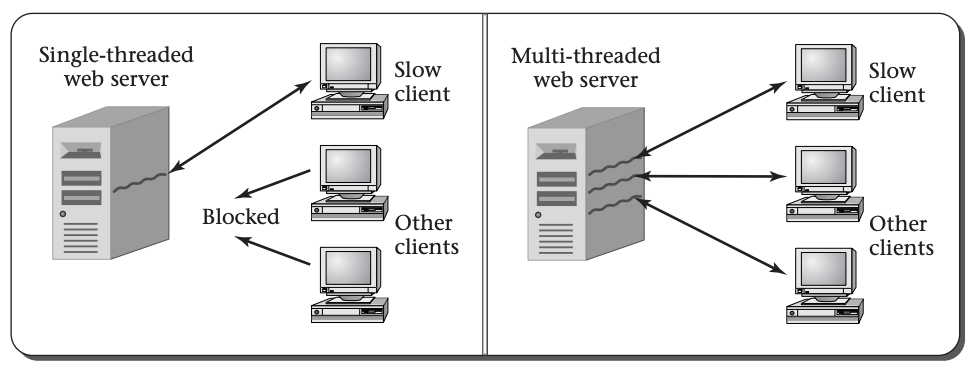
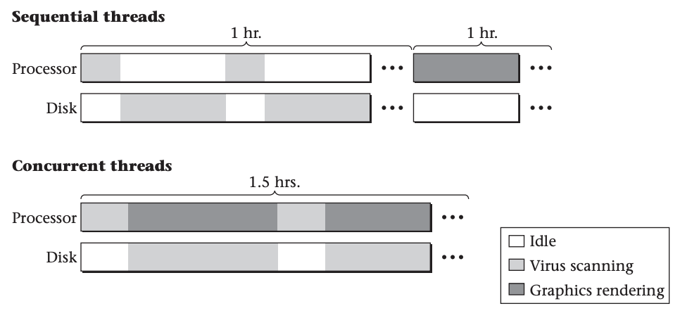

# Threads

Computer programs consist of instructions, and computers carry out sequences of computational steps specified by those
instructions. We call each sequence of computational steps that are strung together one after another a thread. The
simplest programs to write are single-threaded, with instructions that should be executed one after another in a single
sequence. Programs can also have more than one thread of execution, each an independent sequence of computational
steps, with few if any ordering constraints between the steps in one thread and those in another. Multiple threads can
also come into existence by running multiple programs, or by running the same program more than once.

Note the distinction between a program and a thread: the program contains instructions, whereas the thread consists of
the execution of those instructions. Even for single-threaded programs, this distinction matters. If a program contains
a loop, then a very short program could give rise to a very long thread of execution. Also, running the same program ten
times will give rise to ten threads, all executing one program.

Each thread has a lifetime, extending from the time its first instruction execution occurs until the time of its last
instruction execution. If two threads have overlapping lifetimes, we say they are concurrent. One of the most
fundamental goals of an operating system is to allow multiple threads to run concurrently on the same computer. That is,
rather than waiting until the first thread has completed before a second thread can run, it should be possible to divide
the computer’s attention between them. If the computer hardware includes multiple processors, then it will naturally be
possible to run threads concurrently, one per processor. However, the operating system’s users will often want to run
more concurrent threads than the hardware has processors. Therefore, the operating system will need to divide each
processor’s attention between multiple threads.

In order to make the concept of concurrent threads concrete, we will next give an example of  how to write a program that spawns
multiple threads each time the program is run. Once you know how to create threads, we will explain  some
of the reasons why it is desirable to run multiple threads concurrently and will offer some typical examples of the uses
to which threads are put.

## Example of Multithreaded Programs

Whenever a program initially starts running, the computer carries out the program’s instructions in a single thread.
Therefore, if the program is intended to run in multiple threads, the original thread needs at some point to spawn off a
child thread that does some actions, while the parent thread continues to do others. (For more than two threads, the
program can repeat the thread-creation step.) Most programming languages have an application programming interface (or
API) for threads that includes a way to create a child thread. In this section, I will use the API for
C that is called pthreads, for POSIX threads. 

Realistic multithreaded programming requires the control of thread interactions.
Therefore, my examples in this chapter are quite simple, just enough to show the spawning of threads.

To demonstrate the independence of the two threads, I will have both the parent and the child thread respond to a timer.
One will sleep three seconds and then print out a message. The other will sleep five seconds and then print out a
message. Because the *threads* execute concurrently, the second message will appear approximately two seconds after the
first.

```C
#include <pthread.h>
#include <unistd.h>
#include <stdio.h>

static void *child(void *ignored) {
    sleep(3);
    printf("Child is done sleeping 3 seconds.\n");
    return NULL;
}

int main(int argc, char *argv[]) {
    pthread_t child_thread;
    int code;
    code = pthread_create(&child_thread, NULL, child, NULL);
    if(code) {
        fprintf(stderr, "pthread_create failed with code %d\n", code);
    }
    sleep(5);
    printf("Parent is done sleeping 5 seconds.\n");
    return 0;
}
```

The above C program uses the pthreads API.  The child procedure sleeps three seconds and prints a
message. The main procedure creates a child_thread running the child procedure, and then itself sleeps five seconds and
prints a message. 

In addition to portable APIs, such as the Java and pthreads APIs, many systems provide their own non-portable APIs. For
example, Microsoft Windows has the Win32 API, with procedures such as `CreateThread` and `Sleep`. 

## Reasons for Using Concurrent Threads

You have now seen how a single execution of one program can result in more than one thread. Presumably, you were already
at least somewhat familiar with generating multiple threads by running multiple programs, or by running the same program
multiple times. Regardless of how the threads come into being, we are faced with a question. Why is it desirable for the
computer to execute multiple threads concurrently, rather than waiting for one to finish before starting another?
Fundamentally, most uses for concurrent threads serve one of two goals:

- **Responsiveness**: allowing the computer system to respond quickly to something external to the system, such as a
human user or another computer system. Even if one thread is in the midst of a long computation, another thread can
respond to the external agent. Our example program illustrated responsiveness: both the parent and the child thread
responded to a timer.

- **Resource utilization**: keeping most of the hardware resources busy most of the time. If one thread has no need for
a particular piece of hardware, another may be able to make productive use of it.

Each of these two general themes has many variations, some of which we explore in the remainder of this section. A third
reason why programmers sometimes use concurrent threads is as a tool for modularization. With this, a complex system may
be decomposed into a group of interacting threads.

### Responsiveness

Let’s start by considering the responsiveness of a web server, which provides many client computers with the specific
web pages they request over the Internet. Whenever a client computer makes a network connection to the server, it sends
a sequence of bytes that contain the name of the desired web page. Therefore, before the server program can respond, it
needs to read in those bytes, typically using a loop that continues reading in bytes from the network connection until
it sees the end of the request. Suppose one of the clients is connecting using a very slow network connection, perhaps
via a dial-up modem. The server may read the first part of the request and then have to wait a considerable length of
time before the rest of the request arrives over the network. What happens to other clients in the meantime? It would be
unacceptable for a whole website to grind to a halt, unable to serve any clients, just waiting for one slow client to
finish issuing its request. One way some web servers avoid this unacceptable situation is by using multiple threads, one
for each client connection, so that even if one thread is waiting for data from one client, other threads can continue
interacting with the other clients. This figure illustrates the unacceptable single-threaded web server and the more
realistic multithreaded on



On the client side, a web browser may also illustrate the need for responsiveness. Suppose you start loading in a very
large web page, which takes considerable time to download. Would you be happy if the computer froze up until the
download finished? Probably not. You expect to be able to work on a spreadsheet in a different window, or scroll through
the first part of the web page to read as much as has already downloaded, or at least click on the Stop button to give
up on the time-consuming download. Each of these can be handled by having one thread tied up loading the web page over
the network, while another thread is responsive to your actions at the keyboard and mouse.

### Resource Utilization

Turning to the utilization of hardware resources, the most obvious scenario is when you have a dual-processor computer.
In this case, if the system ran only one thread at a time, only half the processing capacity would ever be used. Even if
the human user of the computer system doesn’t have more than one task to carry out, there may be useful housekeeping
work to keep the second processor busy. For example, most operating systems, if asked to allocate memory for an
application program’s use, will store all zeros into the memory first. Rather than holding up each memory allocation
while the zeroing is done, the operating system can have a thread that proactively zeros out unused memory, so that when
needed, it will be all ready. If this housekeeping work (zeroing of memory) were done on demand, it would slow down the
system’s real work; by using a concurrent thread to utilize the available hardware more fully, the performance is
improved. This example also illustrates that not all threads need to come from user programs. A thread can be part of
the operating system itself, as in the example of the thread zeroing out unused memory.

Even in a single-processor system, resource utilization considerations may justify using concurrent threads. Remember
that a computer system contains hardware resources, such as disk drives, other than the processor. Suppose you have two
tasks to complete on your PC: you want to scan all the files on disk for viruses, and you want to do a complicated
photo-realistic rendering of a three-dimensional scene including not only solid objects, but also shadows cast on
partially transparent smoke clouds. From experience, you know that each of these will take about an hour. If you do one
and then the other, it will take two hours. If instead you do the two concurrently—running the virus scanner in one
window while you run the graphics rendering program in another window—you may be pleasantly surprised to find both jobs
done in only an hour and a half.



The explanation for the half-hour savings in elapsed time is that the virus scanning program spends most of its time
using the disk drive to read files, with only modest bursts of processor activity each time the disk completes a read
request, whereas the rendering program spends most of its time doing processing, with very little disk activity. As
illustrated above, running them in sequence leaves one part of the computer’s hardware idle much of the time,
whereas running the two concurrently keeps the processor and disk drive both busy, improving the overall system
efficiency. Of course, this assumes the operating system’s scheduler is smart enough to let the virus scanner have the
processor’s attention (briefly) whenever a disk request completes, rather than making it wait for the rendering program.
This is known as scheduling, and is a topic that we won't get into in this course.

As you have now seen, threads can come from multiple sources and serve multiple roles. They can be internal portions of
the operating system, as in the example of zeroing out memory, or part of the user’s application software. In the latter
case, they can either be dividing up the work within a multithreaded process, such as the web server and web browser
examples, or can come from multiple independent processes, as when a web browser runs in one window and a spreadsheet in
another. Regardless of these variations, the typical reasons for running the threads concurrently remain unchanged:
either to provide increased responsiveness or to improve system efficiency by more fully utilizing the hardware.

We just explored the application programmer’s view of threads: how and why the programmer would use
concurrent threads. This sets us up for the next question: how does the operating system support the application
programmer’s desire for concurrently executing threads? Stay tuned!