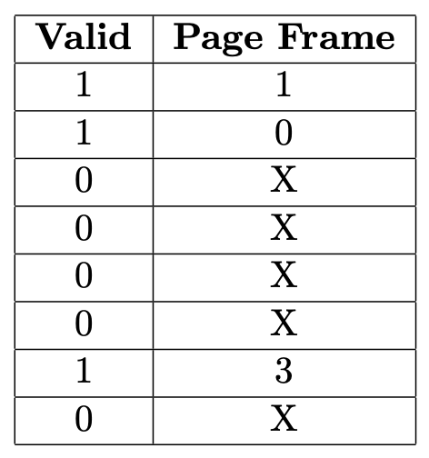
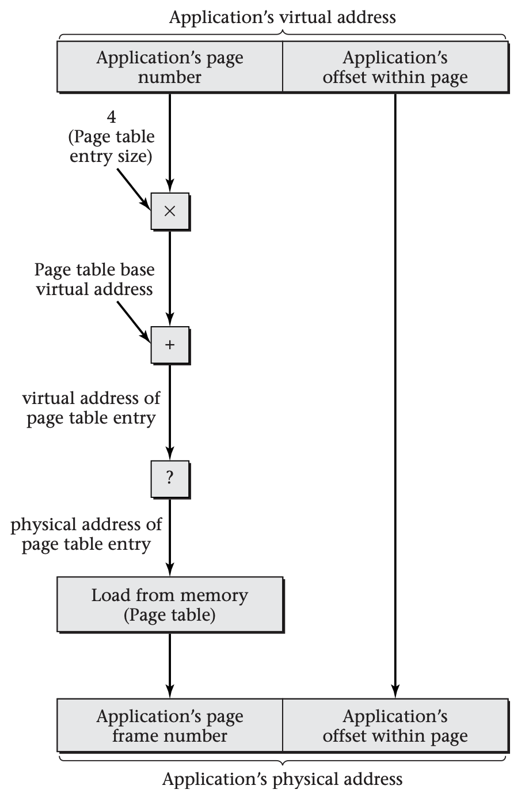
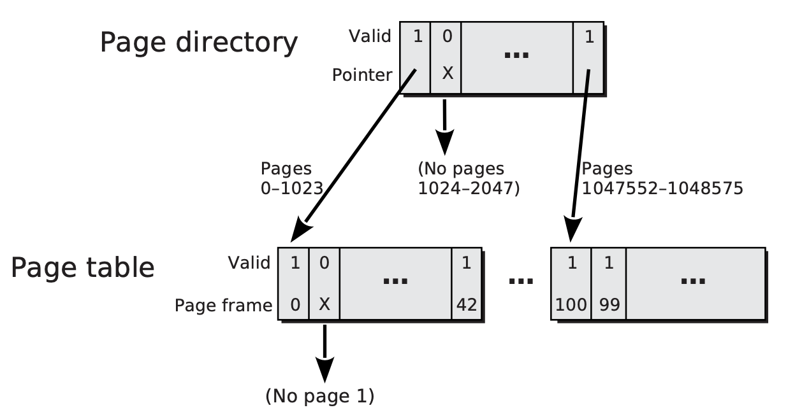
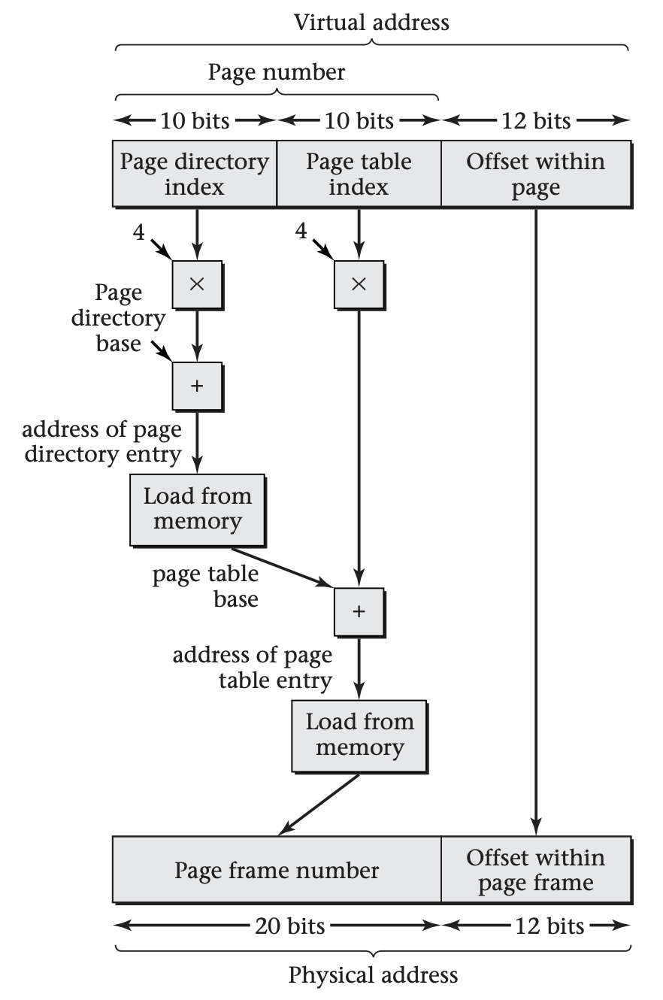
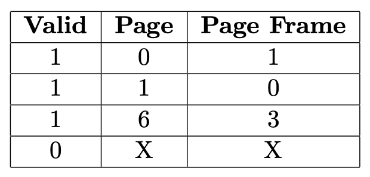

# Mechanisms for Virtual Memory

Address mapping needs to be flexible, yet efficient. This means that the mapping function is stored in an explicit table, but at the granularity of pages rather than individual bytes or words. Many systems today use fixed-size pages, perhaps with a few exceptions for the operating system itself or hardware access, though research suggests that more general mixing of page sizes can be beneficial. (Linux has moved in this direction.)

Typical page sizes have grown over the decades; today, the most common is 4 kibibytes (KiB). Each page of virtual memory and each page frame of physical memory is this size, and each starts at an address that is a multiple of the page size. For example, with 4-KiB pages, the first page (or page frame) has address 0, the next has address 4096, then 8192, and so forth.

Each page of virtual memory address space maps to an underlying page frame of physical memory or to none. For example, the following shows one possible mapping, on a system with unrealistically few pages and page frames.

The numbers next to the boxes are page numbers and page frame numbers. The starting addresses are these numbers multiplied by the page size. At the top of this figure, you can see that page 0 is stored in page frame 1. If the page size is 4 KiB, this means that virtual address 0 translates to physical address 4096, virtual address 100 translates to physical address 4196, and so forth. The virtual address of the last 4-byte word in page 0, 4092, translates to the physical address of the last word in page frame 1, 8188. Up until this point, all physical addresses were found by adding 4096 to the virtual address. However, the very next virtual address, 4096, translates to physical address 0, because it starts a new page, which is mapped differently. Note also that page frame 2 is currently not holding any page, and that pages 2--5 and page 7 have no translation available. 

Of course, a realistic computer system will have many more page frames of physical memory and pages of virtual address space. Often there are tens or hundreds of thousands of page frames and at least hundreds of thousands of pages. As a result, operating system designers need to think carefully about the data structure used to store the table that maps virtual page numbers to physical page frame numbers. The following will be devoted to presenting three alternative structures that are in current use for page tables: linear, multilevel, and hashed.

Whatever data structure the operating system uses for its page table, it will need to communicate the mapping information to the hardware's MMU, which actually performs the mapping. The nature of this software/hardware interface constrains the page table design and also provides important context for comparing the performance of alternative page table structures.

## Software/Hardware Interface

You have seen that the operating system stores some form of page table data structure in memory, showing which physical memory page frame (if any) holds each virtual memory page. Although I will present several possible page table structures shortly, the most important design issue applies equally to all of them: the page table should almost never be used.

Performance considerations explain why such an important data structure should be nearly useless (in the literal sense). Every single memory access performed by the processor generates a virtual address that needs translation to a physical address. Naively, this would mean that every single memory access from the processor requires a lookup operation in the page table. Performing that lookup operation would require at least one more memory access, even if the page table were represented very efficiently. Thus, the number of memory accesses would at least double: for each real access, there would be one page table access. Because memory performance is often the bottleneck in modern computer systems, this means that virtual memory might well make programs run half as fast--unless the page table lookup can be mostly avoided. Luckily, it can.

The virtual addresses accessed by realistic software are not random; instead, they exhibit both *temporal locality* and *spatial locality*. That is, addresses that are accessed once are likely to be accessed again before long, and nearby addresses are also likely to be accessed soon. Because a nearby address is likely to be on the same page, both kinds of locality wind up creating temporal locality when considered at the level of whole pages. If a page is accessed, chances are good that the same page will be accessed again soon, whether for the same address or another.

The MMU takes advantage of this locality by keeping a quickly accessible copy of a modest number of recently used virtual-to-physical translations. That is, it stores a limited number of pairs, each with one page number and the corresponding page frame number. This collection of pairs is called the *translation lookaside buffer* (*TLB*). Most memory accesses will refer to page numbers present in the TLB, and so the MMU will be able to produce the corresponding page frame number without needing to access the page table. This happy circumstance is known as a *TLB hit*; the less fortunate case, where the TLB does not contain the needed translation, is a *TLB miss*.

The TLB is one of the most performance-critical components of a modern microprocessor. In order for the system to have a fast clock cycle time and perform well on small benchmarks, the TLB must be very quickly accessible. In order for the system's performance not to fall off sharply on larger workloads, the TLB must be reasonably large (perhaps hundreds of entries), so that it can still prevent most page table accesses. Unfortunately, these two goals are in conflict with one another: chip designers know how to make lookup tables large or fast, but not both. Coping as well as possible with this dilemma requires cooperation from the designers of hardware, operating system, and application software:

- The hardware designers ameliorate the problem by including *two* TLBs, one for instruction fetches and one for data loads and stores. That way, these two categories of memory access don't need to compete for the same TLB.

- The hardware designers may further ameliorate the problem by including a hierarchy of TLBs, analogous to the cache hierarchy. A small, fast level-one (L1) TLB makes most accesses fast, while a larger, slower level-two (L2) TLB ensures that the page table won't need to be accessed every time the L1 TLB misses. As an example, the AMD Opteron microprocessor contains 40-entry L1 instruction and data TLBs, and it also contains 512-entry L2 instruction and data TLBs.

- The hardware designers also give the operating system designers some tools for reducing the demand for TLB entries. For example, if different TLB entries can provide mappings for pages of varying sizes, the operating system will be able to map large, contiguously allocated structures with fewer TLB entries, while still retaining flexible allocation for the rest of virtual memory.

- The operating system designers need to use tools such as variable page size to reduce TLB entry consumption. At a minimum, even if all application processes use small pages (4 KiB), the operating system itself can use larger pages. Similarly, a video frame buffer of many consecutive megabytes needn't be carved up into 4-KiB chunks. As a secondary benefit, using larger pages can reduce the size of page tables. In many cases, smaller page tables are also quicker to access.

- More fundamentally, all operating system design decisions need to be made with an eye to how they will affect TLB pressure, because this is such a critical performance factor. One obvious example is the normal page size. Another, less obvious, example is the size of the scheduler's time slices: switching processes frequently will increase TLB pressure and thereby hurt performance, even if the TLB doesn't need to be flushed at every process switch. (I will take up that latter issue shortly.)

- The application programmers also have a role to play. Programs that exhibit strong locality of reference will perform much better, not only because of the cache hierarchy, but also because of the TLB. The performance drop-off when your program exceeds the TLB's capacity is generally quite precipitous. Some data structures are inherently more TLB-friendly than others. For example, a large, sparsely occupied table may perform much worse than a smaller, more densely occupied table. In this regard, theoretical analyses of algorithms may be misleading, if they assume all memory operations take a constant amount of time.

At this point, you have seen that each computer system uses two different representations of virtual memory mappings: a page table and a TLB. The page table is a comprehensive but slow representation, whereas the TLB is a selective but fast representation. You still need to learn how entries from the page table get loaded into the TLB. This leads to the topic of the software/hardware interface.

In general, the MMU loads page table entries into the TLB on a demand-driven basis. That is, when a memory access results in a TLB miss, the MMU loads the relevant translation into the TLB from the page table, so that future accesses to the same page can be TLB hits. The key difference between computer architectures is whether the MMU does this TLB loading autonomously, or whether it does it with lots of help from operating system software running on the processor.

In many architectures, the MMU contains hardware, known as a *page table walker*, that can do the page table lookup operation without software intervention. In this case, the operating system must maintain the page table in a fixed format that the hardware understands. For example, on an IA-32 processor (such as the Pentium 4), the operating system has no other realistic option than to use a multilevel page table, because the hardware page table walker expects this format. The software/hardware interface consists largely of a single register that contains the starting address of the page table. The operating system just loads this register and lets the hardware deal with loading individual TLB entries. Of course, there are some additional complications. For example, if the operating system stores updated mapping information into the page table, it needs to flush obsolete entries from the TLB.

In other processors, the hardware has no specialized access to the page table. When the TLB misses, the hardware transfers control to the operating system using an interrupt. The operating system software looks up the missing address translation in the page table, loads the translation into the TLB using a special instruction, and resumes normal execution. Because the operating system does the page table lookup, it can use whatever data structure its designer wishes. The lookup operation is done not with a special hardware walker, but with normal instructions to load from memory. Thus, the omission of a page table walker renders the processor more flexible, as well as simpler. However, TLB misses become more expensive, as they entail a context switch to the operating system with attendant loss of cache locality. The MIPS processor, used in the Sony PlayStation 2, is an example of a processor that handles TLB misses in software.

Architectures also differ in how they handle process switches. Recall that each process may have its own private virtual memory address space. When the operating system switches from one process to another, the translation of virtual addresses to physical addresses needs to change as well. In some architectures, this necessitates flushing all entries from the TLB. (There may be an exception for global entries that are not flushed, because they are shared by all processes.) Other architectures tag the TLB entries with a process identifying number, known as an *address space identifier* (*ASID*). A special register keeps track of the current process's ASID. For the operating system to switch processes, it simply stores a new ASID into this one register; the TLB need not be flushed. The TLB will hit only if the ASID and page number both match, effectively ignoring entries belonging to other processes.

For those architectures with hardware page table walkers, each process switch may also require changing the register pointing to the page table. Typically, linear page tables and multilevel page tables are per process. If an operating system uses a hashed page table, on the other hand, it may share one table among all processes, using ASID tags just like in the TLB.

Having seen how the MMU holds page translations in its TLB, and how those TLB entries are loaded from a page table either by a hardware walker or operating system software, it is time now to turn to the structure of page tables themselves.

## Linear Page Tables

*Linear page tables* are conceptually the simplest form of page table, though as you will see, they turn out to be not quite so simple in practice as they are in concept. A linear page table is an array with one entry per page in the virtual address space. The first entry in the table describes page 0, the next describes page 1, and so forth. To find the information about page \[n\], one uses the same approach as for any array access: multiply \[n\] by the size of a page table entry and add that to the base address of the page table.

Recall that each page either has a corresponding page frame or has none. Therefore, each page table entry contains, at a minimum, a *valid bit* and a page frame number. If the valid bit is 0, the page has no corresponding frame, and the page frame number is unused. If the valid bit is 1, the page is mapped to the specified page frame. Real page tables often contain other bits indicating permissions (for example, whether writing is allowed), dirtiness, and so forth.

The prior figure showed an example virtual memory configuration in which page 0 was held in page frame 1, page 1 in page frame 0, and page 6 in page frame 3. The figure below shows how this information would be expressed in a linear page table.

In a linear page table, the information about page \[n\] is stored at position number \[n\]>, counting from 0. In this example, the first row, position 0, shows that page 0 is stored in page frame 1. The second-to-last row, position 6, shows that page 6 is stored in page frame 3. The rows with valid bit 0 indicate that no page frame holds the corresponding pages, number 2–5 and 7. In these page table entries, the page frame number is irrelevant and can be any number; an X is shown to indicate this.

Notice that the page numbers are not stored in the linear page table; they are implicit in the position of the entries. The first entry is implicitly for page 0, the next for page 1, and so forth, on down to page 7. If each page table entry is stored in 4 bytes, this tiny page table would occupy 32 consecutive bytes of memory. The information that page 3 has no valid mapping would be found 12 bytes after the base address of the table.

The fundamental problem with linear page tables is that real ones are much larger than this example. For a 32-bit address space with 4-KiB pages, there are \[2^{20}\] pages, because 12 of the 32 bits are used to specify a location within a page of 4 KiB or \[2^{12}\] bytes. Thus, if you again assume 4 bytes per page table entry, you now have a 4-MiB page table. Storing one of those per process could use up an undesirably large fraction of a computer's memory. (My computer is currently running 70 processes, for a hypothetical total of 280 MiB of page tables, which would be 36 percent of my total RAM.) Worse yet, modern processors are moving to 64-bit address spaces. Even if you assume larger pages, it is hard to see how a linear page table spanning a 64-bit address space could be stored.

This problem of large page tables is not insurmountable. Linear page tables have been used by 32-bit systems (for example, the VAX architecture, which was once quite commercially important), and even 64-bit linear page tables have been designed--Intel supports them as one option for its current Itanium architecture. Because storing such a huge page table is inconceivable, the secret is to find a way to avoid storing most of the table.

Recall that virtual memory address spaces are generally quite sparse: only a small fraction of the possible page numbers actually have translations to page frames. (This is particularly true on 64-bit systems; the address space is billions of times larger than for 32-bit systems, whereas the number of pages actually used may be quite comparable.) This provides the key to not storing the whole linear page table: you need only store the parts that actually contain valid entries.

On the surface, this suggestion seems to create as big a problem as it solves. Yes, you might now have enough memory to store the valid entries, but how would you ever find the entry for a particular page number? Recall that the whole point of a linear page table is to directly find the entry for page $n$ at the address that is $n$ entries from the beginning of the table. If you leave out the invalid entries, will this work any more? Not if you squish the addresses of the remaining valid entries together. So, you had better not do that.

You need to avoid wasting memory on invalid entries, and yet still be able to use a simple array-indexing address calculation to find the valid entries. In other words, the valid entries need to stay at the same addresses, whether there are invalid entries before them or not. Said a third way, although you want to be thrifty with storage of the page table, you cannot be thrifty with addresses. This combination is just barely possible, because storage and addressing need not be the same.

Divorcing the storage of the page table from the allocation of addresses for its entries requires three insights:

- The pattern of address space usage, although sparse, is not completely random. Often, software will use quite a few pages in a row, leave a large gap, and then use many more consecutive pages. This clumping of valid and invalid pages means that you can decide which portions of the linear page table are worth storing at a relatively coarse granularity and not at the granularity of individual page table entries. You can store those chunks of the page table that contain any valid entries, even if there are also a few invalid entries mixed in, and not store those chunks that contain entirely invalid entries.

- In fact, you can choose your chunks of page table to be the same size as the pages themselves. For example, in a system with 4-KiB pages and 4-byte page table entries, each chunk of page table would contain 1024 page table entries. Many of these chunks won't actually need storage, because there are frequently 1024 unused pages in a row. Therefore, you can view the page table as a bunch of consecutive pages, some of which need storing and some of which don't.

- Now for the trick: use virtual memory to store the page table. That way, you decouple the addresses of page table entries from where they are stored--if anywhere. The virtual addresses of the page table entries will form a nice orderly array, with the entry for page $n$ being $n$ entries from the beginning. The physical addresses are another story. Recall that the page table is divided into page-sized chunks, not all of which you want to store. For those you want to store, you allocate page frames, wherever in memory is convenient. For those you don't want to store, you don't allocate page frames at all.

If this use of virtual memory to store the virtual memory's page table seems dizzying, it should. Suppose you start with a virtual address that has been generated by a running application program. You need to translate it into a physical address. To do so, you want to look up the virtual page number in the page table. You multiply the application-generated virtual page number by the page table entry size, add the base address, and get another virtual address: the virtual address of the page table entry. So, now what? You have to translate the page table entry's virtual address to a physical address. If you were to do this the same way, you would seem to be headed down the path to infinite recursion. Systems that use linear page tables must have a way out of this recursion. Below, the box labeled "?" must not be another copy of the whole diagram. That is where the simple concept becomes a not-so-simple reality.

This diagram shows how a virtual address, generated by an application process, is translated into a physical address using a linear page table. At one point in the translation procedure, indicated by a “?” in this diagram, the virtual address of the page table entry needs to be translated into a physical address. This must be done using a method that is different from the one used for the application’s virtual address, in order to avoid an infinite recursion. To see this, imagine inserting another copy of the whole diagram in place of the “?” box. A second “?” would result, which would require further substitution, and so forth to infinity.

Most solutions to the recursion problem take the form of using two different representations to store the virtual-to-physical mapping information. One (the linear page table) is used for application-generated virtual addresses. The other is used for the translation of page table entries' virtual addresses. For example, a multilevel page table accessed using a physical address can be used to provide the mapping information for the pages holding the main linear page table.

This may leave you wondering what the point of the linear page table is. If another representation is going to be needed anyway, why not use it directly as the main page table, for mapping all pages, rather than only indirectly, for mapping the page table's pages? To answer this, you need to recall that the MMU has a TLB in which it keeps track of recently used virtual-to-physical translations; repeated access to the same virtual page number doesn't require access to the page table. Only when a new page number is accessed is the page table (of whatever kind) accessed. This is true not only when translating the application's virtual address, but also when translating the virtual address of a page table entry.

Depending on the virtual address generated by the application software, there are three possibilities:

1. For an address within the same page as another recent access, no page table lookup is needed at all, because the MMU already knows the translation.

2. For an address on a new page, but within the same chunk of pages as some previous access, only a linear page table lookup is needed, because the MMU already knows the translation for the appropriate page of the linear page table.

3. For an address on a new page, far from others that have been accessed, both kinds of page table lookup are needed, because the MMU has no relevant translations cached in its TLB.

Because virtual memory accesses generally exhibit temporal and spatial locality, most accesses fall into the first category. However, for those accesses, the page table organization is irrelevant. Therefore, to compare linear page tables with alternative organizations, you should focus on the remaining accesses. Of those accesses, spatial locality will make most fall into the second category rather than the third. Thus, even if there is a multilevel page table behind the scenes, it will be used only rarely. This is important, because the multilevel page table may be quite a bit slower than the linear one. Using the combination improves performance at the expense of complexity.

## Multilevel Page Tables

Recall that the practicality of linear page tables relies on two observations:

- Because valid page table entries tend to be clustered, if the page table is divided into page-sized chunks, there will be many chunks that don't need storage.

- The remaining chunks can be located as though they were in one big array by using virtual memory address translation to access the page table itself.

These two observations are quite different from one another. The first is an empirical fact about most present-day software. The second is a design decision. You could accept the first observation while still making a different choice for how the stored chunks are located. This is exactly what happens with *multilevel page tables* (also known as *hierarchical page tables* or *forward-mapped page tables*). They too divide the page table into page-sized chunks, in the hopes that most chunks won't need storage. However, they locate the stored chunks without recursive use of virtual memory by using a tree data structure, rather than a single array.

For simplicity, start by considering the two-level case. This suffices for 32-bit architectures and is actually used in the extremely popular IA-32 architecture, the architecture of Intel's Pentium and AMD's Athlon family microprocessors. The IA-32 architecture uses 4-KiB pages and has page table entries that occupy 4 bytes. Thus, 1024 page-table entries fit within one page-sized chunk of the page table. As such, a single chunk can span 4 MiB of virtual address space. Given that the architecture uses 32-bit virtual addresses, the full virtual address space is 4 gibibytes (GiB) (that is, \[2^{32}\] bytes); it can be spanned by 1024 chunks of the page table. All you need to do is locate the storage of each of those 1024 chunks or, in some cases, determine that the chunk didn't merit storage. You can do that using a second-level structure, much like each of the chunks of the page table. It, too, is 4 KiB in size and contains 1024 entries, each of which is 4 bytes. However, these entries in the second-level point to the 1024 first-level chunks of the page table, rather than to individual page frames. See below for an illustration of the IA-32 page table's two-level hierarchy, with branching factor 1024 at each level. In this example, page 1 is invalid, as are pages 1024-2047.

The IA-32 two-level page table has a page directory that can point to 1024 chunks of the page table, each of which can point to 1024 page frames. For example, the leftmost entry of the leftmost chunk of the page table points to the page frame holding page 0, which is page frame 0; besides, page frame 42 holds page 1023, while page frames 100 and 99 hold pages 1047552 and 1047553, respectively. Each entry can also be marked invalid, indicated by a valid bit of 0 and an X in this diagram. For example, the second entry in the first chunk of the page table is invalid, showing that no page frame holds page 1. The same principle applies at the page directory level; in this example, no page frames hold pages 1024–2047, so the second page directory entry is marked invalid.

The operating system on an IA-32 machine stores the physical base address of the page directory in a special register, where the hardware's page table walker can find it. Suppose that at some later point, the processor generates a 32-bit virtual address and presents it to the MMU for translation. The following figure shows the core of the translation process, omitting the TLB and the validity checks.

This diagram shows only the core of IA-32 paged address mapping, omitting the TLB and validity checks. The virtual address is divided into a 20-bit page number and 12-bit offset within the page; the latter 12 bits are left unchanged by the translation process. The page number is subdivided into a 10-bit page directory index and a 10-bit page table index. Each index is multiplied by 4, the number of bytes in each entry, and then added to the base physical address of the corresponding data structure, producing a physical memory address from which the entry is loaded. The base address of the page directory comes from a register, whereas the base address of the page table comes from the page directory entry.

In more detail, the MMU follows the following translation process:

1. Initially divide the 32-bit virtual address into its left-hand 20 bits (the page number) and right-hand 12 bits (the offset within the page).

2. Look up the 20-bit page number in the TLB. If a TLB hit occurs, concatenate the resulting page frame number with the 12-bit offset to form the physical address. The process is over.

3. On the other hand, if a TLB miss occurred, subdivide the 20-bit page number into its left-hand 10 bits (the page directory index) and its right-hand 10 bits (the page table index).

4. Load the page directory entry from memory; its address is four times the page directory index plus the page directory base address, which is taken from the special register.

5. Check the page directory entry's valid bit. If it is 0, then there is no page frame holding the page in question--or any of its 1023 neighbors, for that matter. Interrupt the processor with a page fault.

6. Conversely, if the valid bit is 1, the page directory entry also contains a physical base address for a chunk of page table.

7. Load the page table entry from memory; its address is four times the page table index plus the page table base address, which comes from the previous step.

8. Check the page table entry's valid bit. If it is 0, then there is no page frame holding the page in question. Interrupt the processor with a page fault.

9. On the other hand, if the valid bit is 1, the page table entry also contains the physical page frame number. Load the TLB and complete the memory access.

This description, although somewhat simplified, shows the key feature of the IA-32 design: it has a compact page directory, with each entry covering a span of 4 MiB. For the 4-MiB regions that are entirely invalid, nothing further is stored. For the regions containing valid pages, the page directory entry points to another compact structure containing the individual page table entries.

The actual IA-32 design derives some additional advantages from having the page directory entries with their 4-MiB spans:

- Each page directory entry can optionally point directly to a single large 4-MiB page frame, rather than pointing to a chunk of page table entries leading indirectly to 4-KiB page frames, as I described. This option is controlled by a page-size bit in the page directory entry. By using this feature, the operating system can more efficiently provide the mapping information for large, contiguously allocated structures.

- Each page directory entry contains permission bits, just like the page table entries do. Using this feature, the operating system can mark an entire 4-MiB region of virtual address space as being read-only more quickly, because it doesn't need to set the read-only bits for each 4-KiB page in the region. The translation process outlined earlier is extended to check the permission bits at each level and signal a page fault interrupt if there is a permission violation at either level.

The same principle used for two-level page tables can be expanded to any greater number of levels. In data structures, you may seethis structure called a *trie* (or perhaps a *radix tree* or *digital tree*). The virtual page number is divided into groups of consecutive bits. Each group of bits forms an index for use at one level of the tree, starting with the leftmost group at the top level. The indexing at each level allows the chunk at the next level down to be located.

For example, the AMD64 architecture (used in the Opteron and Athlon 64 processors and later imitated by Intel under the name IA-32e) employs four-level page tables of this kind. Although the AMD64 is nominally a 64-bit architecture, the virtual addresses are actually limited to only 48 bits in the current version of the architecture. Because the basic page size is still 4 KiB, the rightmost 12 bits are still the offset within a page. Thus, 36 bits remain for the virtual page number. Each page table entry (or similar entry at the higher levels) is increased in size to 8 bytes, because the physical addresses are larger than in IA-32. Thus, a 4-KiB chunk of page table can reference only 512 pages spanning 2 MiB. Similarly, the branching factor at each higher level of the tree is 512. Because 9 bits are needed to select from 512 entries, it follows that the 36-bit virtual page number is divided into four groups of 9 bits each, one for each level of the tree.

Achieving adequate performance with a four-level page table is challenging. The AMD designers will find this challenge intensified if they extend their architecture to full 64-bit virtual addresses, which would require two more levels be added to the page table. Other designers of 64-bit processors have made different choices: Intel's Itanium uses either linear page tables or hashed page tables, and the PowerPC uses hashed page tables.

## Hashed Page Tables

You have seen that linear page tables and multilevel page tables have a strong family resemblance. Both designs rely on the assumption that valid and invalid pages occur in large clumps. As a result, each allows you to finesse the dilemma of wanting to store page table entries for successive pages consecutively in memory, yet not wanting to waste storage on invalid entries. You store page table entries consecutively within each chunk of the table and omit storage for entire chunks of the table.

Suppose you take a radical approach and reject the starting assumption. You will still assume that the address space is sparsely occupied; that is, many page table entries are invalid and should not be stored. (After all, no one buys \[2^{64}$\] scattered randomly throughout the whole address space. This allows greater flexibility for the designers of runtime environments. As a consequence, you will have to store individual valid page table entries, independent of their neighbors.

Storing only individual valid page table entries without storing any of the invalid entries takes away the primary tool used by the previous approaches for locating entries. You can no longer find page $n$'s entry by indexing $n$ elements into an array--not even within each chunk of the address space. Therefore, you need to use an entirely different approach to locating page table entries. You can store them in a hash table, known as a .

A hashed page table is an array of *hash buckets*, each of which is a fixed-sized structure that can hold some small number of page table entries. (In the Itanium architecture, each bucket holds one entry, whereas in the PowerPC, each bucket holds eight entries.) Unlike the linear page table, this array of buckets does not have a private location for each virtual page number; as such, it can be much smaller, particularly on 64-bit architectures.

Because of this reduced array size, the page number cannot be directly used as an index into the array. Instead, the page number is first fed through a many-to-one function, the *hash function*. That is, each page gets assigned a specific hash bucket by the hash function, but many different pages get assigned the same bucket. The simplest plausible hash function would be to take the page number modulo the number of buckets in the array. For example, if there are 1000000 hash buckets, then the page table entries for pages 0, 1000000, 2000000, and so forth would all be assigned to bucket 0, while pages 1, 1000001, 2000001, and so forth would all be assigned to bucket 1.

The performance of the table relies on the assumption that only a few of the pages assigned to a bucket will be valid and hence have page table entries stored. That is, the assumption is that only rarely will multiple valid entries be assigned to the same bucket, a situation known as a . To keep collisions rare, the page table size needs to scale with the number of valid page table entries. Luckily, systems with lots of valid page table entries normally have lots of physical memory and therefore have room for a bigger page table.

Even if collisions are rare, there must be some mechanism for handling them. One immediate consequence is that each page table entry will now need to include an indication of which virtual page number it describes. In the linear and multilevel page tables, the page number was implicit in the location of the page table entry. Now, any one of many different page table entries could be assigned to the same location, so each entry needs to include an identifying tag, much like in the TLB.

For an unrealistically small example of using a hashed page table, we can return to the prior example. Suppose you have a hashed page table with four buckets, each capable of holding one entry. Each of the four entries will contain both a virtual page number and a corresponding physical page frame number. If the hash function consists of taking the page number modulo 4, the table would contain approximately the information shown below:

Each entry in a hashed page table is in a location determined by feeding the page number through a hash function. In this example, the hash function consists of taking the page number modulo the number of entries in the table, 4. Consider the entry recording that page 6 is held by page frame 3. This entry is in position 2 within the table (counting from 0) because the remainder when 6 is divided by 4 is 2.

The possibility of collisions has another consequence, beyond necessitating page number tags. Even if collisions occur, each valid page table entry needs to be stored somewhere. Because the colliding entries cannot be stored in the same location, some alternative location needs to be available. One possibility is to have alternative locations within each hash bucket; this is why the PowerPC has room for eight page table entries in each bucket. Provided no collision involves more than this number of entries, they can all be stored in the same bucket. The PowerPC searches all entries in the bucket, looking for one with a matching tag.

If a collision involving more than eight entries occurs on a PowerPC, or any collision at all occurs on an Itanium processor, the collision cannot be resolved within the hash bucket. To handle such collisions, the operating system can allocate some extra memory and chain it onto the bucket in a linked list. This will be an expensive but rare occurrence. As a result, hardware page table walkers do not normally handle this case. If the walker does not find a matching tag within the bucket, it uses an interrupt to transfer control to the operating system, which is in charge of searching through the linked list.

You have now seen two reasons why the page table entries in hashed page tables need to be larger than those in linear or multilevel page tables. The hashed page table entries need to contain virtual page number tags, and each bucket needs a pointer to an overflow chain. As a result of these two factors and the addition of some extra features, the Itanium architecture uses 32-byte entries for hashed page tables versus 8-byte entries for linear page tables.

Incidentally, the fact that the Itanium architecture supports two different page table formats suggests just how hard it is to select one. Research continues into the relative merits of the different formats under varying system workloads. As a result of this research, future systems may use other page table formats beyond those described here, though they are likely to be variants on one of these themes. Architectures such as MIPS that have no hardware page table walker are excellent vehicles for such research, because they allow the operating system to use any page table format whatsoever.

Some operating systems treat a hashed page table as a *software TLB*, a table similar to the hardware's TLB in that it holds only selected page table entries. In this case, no provision needs to be made for overfull hash buckets; the entries that don't fit can simply be omitted. A slower multilevel page table provides a comprehensive fallback for misses in the software TLB. This alternative is particularly attractive when porting an operating system (such as Linux) that was originally developed on a machine with multilevel page tables.

