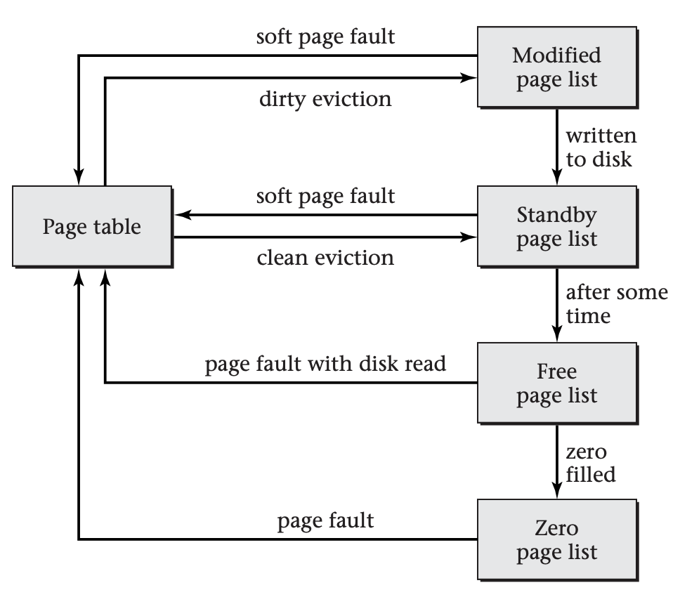
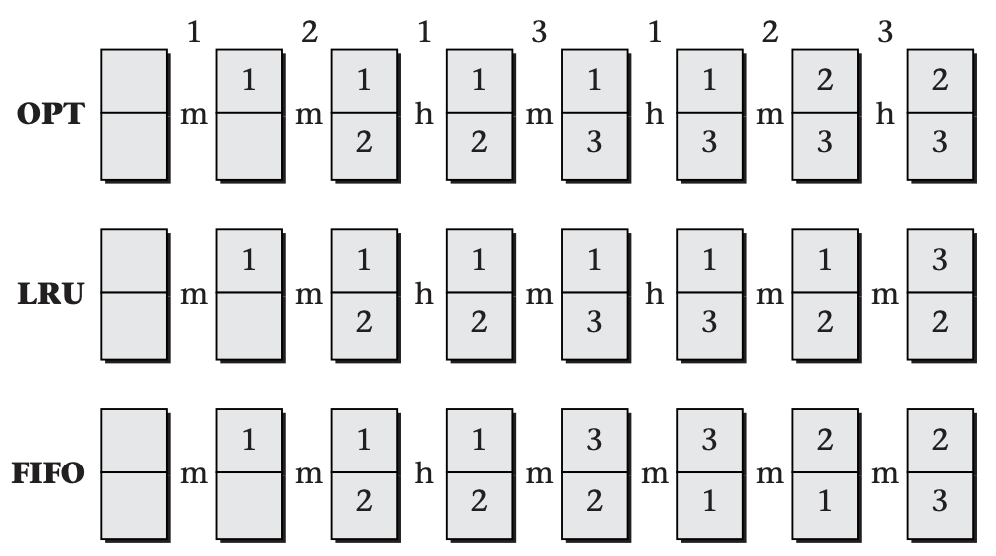

# Policies for Virtual Memory

Thus far, I have defined virtual memory, explained its usefulness, and shown some of the mechanisms typically used to map pages to page frames. Mechanisms alone, however, are not enough. The operating system also needs a set of policies describing how the mechanisms are used. Those policies provide answers for the following questions:

- At what point is a page assigned a page frame? Not until the page is first accessed, or at some earlier point? This decision is particularly performance critical if the page needs to be fetched from disk at the time it is assigned a page frame. For this reason, the policy that controls the timing of page frame assignment is normally called the *fetch policy*.

- Which page frame is assigned to each page? I have said that each page may be assigned any available frame, but some assignments may result in improved performance of the processor's cache memory. The policy that selects a page frame for a page is known as the *placement policy*.

- If the operating system needs to move some inactive page to disk in order to free up a page frame, which page does it choose? This is known as the *replacement policy*, because the page being moved to disk will presumably be replaced by a new page---that being the motivation for freeing a page frame.

All of these policies affect system performance in ways that are quite workload dependent. For example, a replacement policy that performs well for one workload might perform terribly on another; for instance, it might consistently choose to evict a page that is accessed again a moment later. As such, these policies need to be chosen and refined through extensive experimentation with many real workloads. In the following subsections, I will focus on a few sample policies that are reasonably simple and have performed adequately in practice.

## Fetch Policy

The operating system has wide latitude regarding when each page is assigned a page frame. At one extreme, as soon as the operating system knows about a page's existence, it could assign a page frame. For example, when a process first starts running, the operating system could immediately assign page frames for all the pages holding the program and its statically allocated data. Similarly, when a process asks the operating system to map a file into the virtual memory address space, the operating system could assign page frames for the entire file. At the other extreme, the operating system could wait for a page fault caused by an access to a page before assigning that page a page frame. In between these extremes lies a range of realistic fetch policies that try to stay just a little ahead of the process's needs.

Creating all page mappings right away would conflict with many of the original goals for virtual memory, such as fast start up of programs that contain large but rarely used portions. Therefore, one extreme policy can be discarded. The other, however, is a reasonable choice under some circumstances. A system is said to use *demand paging* if it creates the mapping for each page in response to a page fault when accessing that page. Conversely, it uses *prepaging* if it attempts to anticipate future page use.

Demand paging has the advantage that it will never waste time creating a page mapping that goes unused; it has the disadvantage that it incurs the full cost of a page fault for each page. On balance, demand paging is particularly appropriate under the following circumstances:

- If the process exhibits limited spatial locality, the operating system is unlikely to be able to predict what pages are going to be used soon. This makes paging in advance of demand less likely to pay off.

- If the cost of a page fault is particularly low, even moderately accurate predictions of future page uses may not pay off, because so little is gained each time a correct prediction allows a page fault to be avoided.

The Linux operating system uses demand paging in exactly the circumstances suggested by this analysis. The fetch policy makes a distinction between zero-filled pages and those that are read from a file, because the page fault costs are so different. Linux uses demand paging for zero-filled pages because of their comparatively low cost. In contrast, Linux ordinarily uses a variant of prepaging (which I explain in the remainder of this subsection) for files mapped into virtual memory. This makes sense because reading from disk is slow. However, if the application programmer notifies the operating system that a particular memory-mapped file is going to be accessed in a "random" fashion, then Linux uses demand paging for that file's pages. The programmer can provide this information using the `madvise` procedure.

The most common form of prepaging is *clustered paging*, in which each page fault causes a cluster of neighboring pages to be fetched, including the one incurring the fault. Clustered paging is also called *read round*, because pages around the faulting page are read. (By contrast, *read ahead* reads the faulting page and later pages, but no earlier ones.)

The details of clustered paging vary between operating systems. Linux reads a cluster of sixteen pages aligned to start with a multiple of 16. For example, a page fault on any of the first sixteen pages of a file will cause those sixteen pages to be read. Thus, the extra fifteen pages can be all before the faulting page, all after it, or any mix. Microsoft Windows uses a smaller cluster size, which depends in part on the kind of page incurring the fault: instructions or data. Because instruction accesses generally exhibit more spatial locality than data accesses, Windows uses a larger cluster size for instruction pages than for data pages.

Linux's read around is actually a slight variant on the prepaging theme. When a page fault occurs, the fault handler fetches a whole cluster of pages into RAM but only updates the faulting page table entry. The other pages are in RAM but not mapped into any virtual address space; this status is known as the *page cache*. Subsequent page faults can quickly find pages in the page cache. Thus, read around doesn't decrease the total number of page faults, but converts many from *major page faults* (reading disk) to *minor page faults* (simply updating the page table).

Because reading from disk takes about 10 milliseconds and because reading sixteen pages takes only slightly longer than reading one, the success rate of prepaging doesn't need to be especially high for it to pay off. For example, if the additional time needed to read and otherwise process each prepaged page is half a millisecond, then reading a cluster of sixteen pages, rather than a single page, adds 7.5 milliseconds. This would be more than repaid if even a single one of the fifteen additional pages gets used, because the prepaging would avoid a 10-millisecond disk access time.

## Placement Policy

Just as the operating system needs to determine when to make a page resident (on demand or in advance), it needs to decide where the page should reside by selecting one of the unused page frames. This choice influences the physical memory addresses that will be referenced and can thereby influence the miss rate of the cache memory hardware.

Although cache performance is the main issue in desktop systems, there are at least two other reasons why the placement policy may matter. In large-scale multiprocessor systems, main memory is distributed among the processing nodes. As such, any given processor will have some page frames it can more rapidly access. Microsoft's Windows Server 2003 takes this effect into account when allocating page frames. Another issue, likely to become more important in the future, is the potential for energy savings if all accesses can be confined to only a portion of memory, allowing the rest to be put into standby mode.

To explain why the placement policy influences cache miss rate, I need to review cache memory organization. An idealized cache would hold the \[n\] most recently accessed blocks of memory, where \[n\] is the cache's size. However, this would require each cache access to examine all \[n\] blocks, looking to see if any of them contains the location being accessed. This approach, known as *full associativity*, is not feasible for realistically large caches. Therefore, real caches restrict any given memory location to only a small set of positions within the cache; that way, only those positions need to be searched. This sort of cache is known as *set-associative*. For example, a two-way set-associative cache has two alternative locations where any given memory block can be stored. Many caches, particularly those beyond the first level (L1), use the physical address rather than the virtual address to select a set.

Consider what would happen if a process repeatedly accesses three blocks of memory that have the misfortune of all competing for the same set of a two-way set-associative cache. Even though the cache may be large--capable of holding far more than the three blocks that are in active use--the miss rate will be very high. The standard description for this situation is to say the cache is suffering from *conflict misses* rather than *capacity misses*. Because each miss necessitates an access to the slower main memory, the high rate of conflict misses will significantly reduce performance.

The lower the cache's associativity, the more likely conflict misses are to be a problem. Thus, careful page placement was more important in the days when caches were external to the main microprocessor chips, as external caches are often of low associativity. Improved semiconductor technology has now allowed large caches to be integrated into microprocessors, making higher associativity economical and rendering placement policy less important.

Suppose, though, that an operating system does wish to allocate page frames to reduce cache conflicts. How should it know which pages are important to keep from conflicting? One common approach is to assume that pages that would not conflict without virtual memory address translation should not conflict even with address translation; this is known as . Another common approach is to assume that pages that are mapped into page frames soon after one another are likely to also be accessed in temporal proximity; therefore, they should be given nonconflicting frames. This is known as *bin hopping*.

The main argument in favor of page coloring is that it leaves intact any careful allocation done at the level of virtual addresses. Some compiler authors and application programmers are aware of the importance of avoiding cache conflicts, particularly in high-performance scientific applications, such as weather forecasting. For example, the compiler or programmer may pad each row of an array with a little wasted space so that iterating down a column of the array won't repeatedly access the same set of the cache. This kind of cache-conscious data allocation will be preserved by page coloring.

The main argument in favor of bin hopping is that experimental evidence suggests it performs better than page coloring does, absent cache-conscious data allocation. This may be because page coloring is less flexible than bin hopping, providing only a way of deciding on the most preferred locations in the cache for any given page, as opposed to ranking all possible locations from most preferred to least.

## Replacement Policy

Conceptually, a replacement policy chooses a page to evict every time a page is fetched with all page frames in use. However, operating systems typically try do some eviction in advance of actual demand, keeping an inventory of free page frames. When the inventory drops below a *low-water mark*, the replacement policy starts freeing up page frames, continuing until the inventory surpasses a *high-water mark*. Freeing page frames in advance of demand has three advantages:

- Last-minute freeing in response to a page fault will further delay the process that incurred the page fault. In contrast, the operating system may schedule proactive work to maintain an inventory of free pages when the hardware is otherwise idle, improving response time and throughput.

- Evicting dirty pages requires writing them out to disk first. If the operating system does this proactively, it may be able to write back several pages in a single disk operation, making more efficient use of the disk hardware.

- In the time between being freed and being reused, a page frame can retain a copy of the page it most recently held. This allows the operating system to inexpensively recover from poor replacement decisions by retrieving the page with only a minor page fault instead of a major one. That is, the page can be retrieved by mapping it back in without reading it from disk. You will see that this is particularly important if the MMU does not inform the replacement policy which pages have been recently referenced.

In a real operating system, a page frame may go through several temporary states between when it is chosen for replacement and when it is reused. For example, Microsoft Windows may move a replaced page frame through the following four inventories of page frames, as illustrated below:

Each page frame in Microsoft Windows that is not referenced from a page table is included in one of the four page lists. Page frames circulate as shown here. For example, the system can use a soft page fault to recover a page frame from the modified or standby page list, if the page contained in that page frame proves to still be needed after having been evicted by the replacement policy.

- When the replacement policy first chooses a dirty page frame, the operating system moves the frame from a process's page table to the *modified page list*. The modified page list retains information on the previous page mapping so that a minor page fault can retrieve the page. (Microsoft calls this a *soft page fault*.)

- If a page frame remains in the modified page list long enough, a system thread known as the *modified page writer* will write the contents out to disk and move the frame to the *standby page list*. A page frame can also move directly from a process's page table to the standby page list if the replacement policy chooses to evict a clean page. The standby page list again retains the previous mapping information so that a soft page fault can inexpensively recover a prematurely evicted page.

- If a page frame remains on standby for long enough without being faulted back into use, the operating system moves it to the *free page list*. This list provides page frames for the system's *zero page thread* to proactively fill with zeros, so that zero-filled pages will be available to quickly respond to page faults, as discussed earlier. The operating system also prefers to use a page frame from the free list when reading a page in from disk.

- Once the zero page thread has filled a free page frame with zeros, it moves the page frame to the *zero page list*, where it will remain until mapped back into a process's page table in response to a page fault.

Using a mechanism such as this example from Windows, an operating system keeps an inventory of page frames and thus need not evict a page every time it fetches a page. In order to keep the size of this inventory relatively stable over the long term, the operating system balances the rate of page replacements with the rate of page fetches. It can do this in either of two different ways, which lead to the two major categories of replacement policies, *local replacement* and *global replacement*.

Local replacement keeps the rate of page evictions and page fetches balanced individually for each process. If a process incurs many page faults, it will have to relinquish many of its own page frames, rather than pushing other processes' pages out of their frames. The replacement policy chooses which page frames to free only from those held by a particular process. A separate allocation policy decides how many page frames each process is allowed.

Global replacement keeps the rate of page evictions and page fetches balanced only on a system-wide basis. If a process incurs many page faults, other process's pages may be evicted from their frames. The replacement policy chooses which page frames to free from all the page frames, regardless which processes they are used by. No separate page frame allocation policy is needed, because the replacement policy and fetch policy will naturally wind up reallocating page frames between processes.

Of the operating systems popular today, Microsoft Windows uses local replacement, whereas all the members of the UNIX family, including Linux and Mac OS X, use global replacement. Microsoft's choice of a local replacement policy for Windows was part of a broader pattern of following the lead of Digital Equipment Corporation's VMS operating system, which has since become HP's OpenVMS. The key reason why VMS's designers chose local replacement was to prevent poor locality of reference in one process from greatly hurting the performance of other processes. Arguably, this performance isolation is less relevant for a typical Windows desktop or server workload than for VMS's multi-user real-time and timesharing workloads. Global replacement is simpler, and it more flexibly adapts to processes whose memory needs are not known in advance. For these reasons, it tends to be more efficient.

Both local and global replacement policies may be confronted with a situation where the total size of the processes' working sets exceeds the number of page frames available. In the case of local replacement, this manifests itself when the allocation policy cannot allocate a reasonable number of page frames to each process. In the case of global replacement, an excessive demand for memory is manifested as *thrashing*, that is, by the system spending essentially all its time in paging and process switching, producing extremely low throughput.

The traditional solution to excess memory demand is *swapping*. The operating system picks some processes to evict entirely from memory, writing all their data to disk. Moreover, it removes those processes' threads from the scheduler's set of runnable threads, so that they will not compete for memory space. After running the remaining processes for a while, the operating system swaps some of them out and some of the earlier victims back in. Swapping adds to system complexity and makes scheduling much choppier; therefore, some global replacement systems such as Linux omit it and rely on users to steer clear of thrashing. Local replacement systems such as Microsoft Windows, on the other hand, have little choice but to include swapping. For simplicity, I will not discuss swapping further in this text. You should know what it is, however, and should also understand that some people incorrectly call paging swapping; for example, you may hear of Linux swapping, when it really is paging. That is, Linux is moving individual pages of a process's address space to disk and back, rather than moving the entire address space.

Having seen some of the broader context into which replacement policies fit, it is time to consider some specific policies. I will start with one that is unrealistic but which provides a standard against which other, more realistic policies can be measured. If the operating system knew in advance the full sequence of virtual memory accesses, it could select for replacement the page that has its next use furthest in the future. This turns out to be more than just intuitively appealing: one can mathematically prove that it optimizes the number of demand fetches. Therefore, this replacement policy is known as *optimal replacement* (*OPT*).

Real operating systems don't know future page accesses in advance. However, they may have some data that allows the probability of different page accesses to be estimated. Thus, a replacement policy could choose to evict the page estimated to have the longest time until it is next used. As one special case of this, consider a program that distributes its memory accesses across the pages randomly but with unequal probabilities, so that some pages are more frequently accessed than others. Suppose that these probabilities shift only slowly. In that case, pages which have been accessed frequently in the recent past are likely to be accessed again soon, and conversely, those that have not been accessed in a long while are unlikely to be accessed soon. As such, it makes sense to replace the page that has gone the longest without being accessed. This replacement policy is known as *Least Recently Used* (*LRU*).

LRU replacement is more realistic than OPT, because it uses only information about the past, rather than about the future. However, even LRU is not entirely realistic, because it requires keeping a list of page frames in order by most recent access time and updating that list on every memory access. Therefore, LRU is used much as OPT is, as a standard against which to compare other policies. However, LRU is not a gold standard in the same way that OPT is; while OPT is optimal among all policies, LRU may not even be optimal among policies relying only on past activity. Real processes do not access pages randomly with slowly shifting probability distributions. For example, a process might repeatedly loop through a set of pages, in which case LRU will perform terribly, replacing the page that will be reused soonest. Nonetheless, LRU tends to perform reasonably well in many realistic settings; therefore, many other replacement policies try to approximate it. While they may not replace the least recently used page, they will at least replace a page that hasn't been used very recently.

Before considering realistic policies that approximate LRU, I should introduce one other extremely simple policy, which can serve as a foundation for an LRU-approximating policy, though it isn't one itself. The simple policy is known as *first in, first out* (*FIFO). The name tells the whole story: the operating system chooses for replacement whichever page frame has been holding its current page the longest. Note the difference between FIFO and LRU; FIFO chooses the page that was fetched the longest ago, even if it continues to be in frequent use, whereas LRU chooses the page that has gone the longest without access. The figure below shows an example where LRU outperforms FIFO and is itself outperformed by OPT. 

In this comparison of the OPT, LRU, and FIFO replacement policies, each pair of boxes represents the two page frames available on an unrealistically small system. The numbers within the boxes indicate which page is stored in each page frame. The numbers across the top are the reference sequence, and the letters h and m indicate hits and misses. In this example, LRU performs better than FIFO, in that it has one more hit. OPT performs even better, with three hits.

FIFO is not a very smart policy; in fact, early simulations showed that it performs comparably to random replacement. Beyond this mediocre performance, one sign that FIFO isn't very smart is that it suffers from *Belady's anomaly*: increasing the number of page frames available may increase the number of page faults, rather than decreasing it as one would expect.

Both OPT and LRU are immune from Belady's anomaly, as are all other members of the class of *stack algorithms*. A stack algorithm is a replacement policy with the property that if you run the same sequence of page references on two systems using that replacement policy, one with \[n\] page frames and the other with \[n+1\], then at each point in the reference sequence the \[n\] pages that occupy page frames on the first system will also be resident in page frames on the second system. For example, with the LRU policy, the \[n\] most recently accessed pages will be resident in one system, and the \[n+1\] most recently accessed pages will be resident in the other. Clearly the \[n+1\] most recently accessed pages include the \[n\] most recently accessed pages. 

Recall that at the beginning of this subsection, I indicated that page frames chosen for replacement are not immediately reused, but rather enter an inventory of free page frames. The operating system can recover a page from this inventory without reading from disk, if the page is accessed again before the containing page frame is reused. This refinement turns out to dramatically improve the performance of FIFO. If FIFO evicts a page that is frequently used, chances are good that it will be faulted back in before the page frame is reused. At that point, the operating system will put it at the end of the FIFO list, so it will not be replaced again for a while. Essentially, the FIFO policy places pages on probation, but those that are accessed while on probation aren't actually replaced. Thus, the pages that wind up actually replaced are those that were not accessed recently, approximating LRU. This approximation to LRU, based on FIFO, is known as *Segmented FIFO* (*SFIFO*).

To enable smarter replacement policies, some MMUs provide a in each page table entry. Every time the MMU translates an address, it sets the corresponding page's reference bit to 1. (If the address translation is for a write to memory, the MMU also sets the dirty bit that I mentioned earlier.) The replacement policy can inspect the reference bits and set them back to 0. In this way, the replacement policy obtains information on which pages were recently used. Reference bits are not easy to implement efficiently, especially in multiprocessor systems; thus, some systems omit them. However, when they exist, they allow the operating system to find whether a page is in use more cheaply than by putting it on probation and seeing whether it gets faulted back in.

One replacement policy that uses reference bits to approximate LRU is *clock replacement*. In clock replacement, the operating system considers the page frames cyclically, like the hand of a clock cycling among the numbered positions. When the replacement policy's clock hand is pointing at a particular page, the operating system inspects that page's reference bit. If the bit is 0, the page has not been referenced recently and so is chosen for replacement. If the bit is 1, the operating system resets it to 0 and moves the pointer on to the next candidate. That way, the page has a chance to prove its utility, by having its reference bit set back to 1 before the pointer comes back around. As a refinement, the operating system can also take the dirty bit into account, as follows:

- reference = 1: set reference to 0 and move on to the next candidate

- reference = 0 and dirty = 0: choose this page for replacement

- reference = 0  and dirty = 1: start writing the page out to disk and move on to the next candidate; when the writing is complete, set dirty to 0

Replacement policies such as FIFO and clock replacement can be used locally to select replacement candidates from within a process, as well as globally. For example, some versions of Microsoft Windows use clock replacement as the local replacement policy on systems where reference bits are available, and FIFO otherwise.