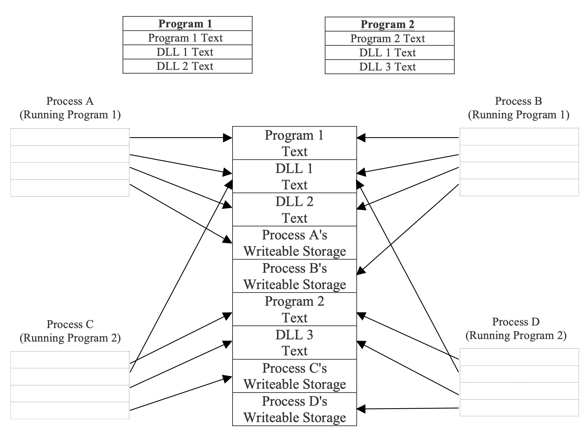
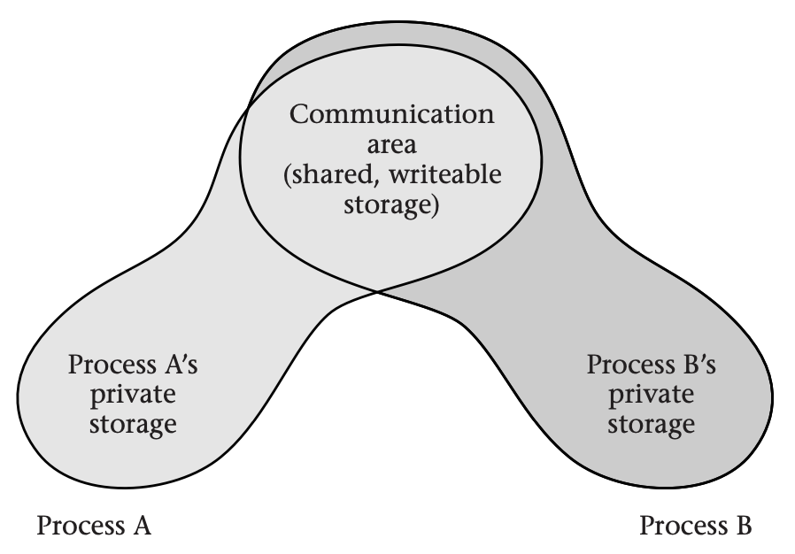
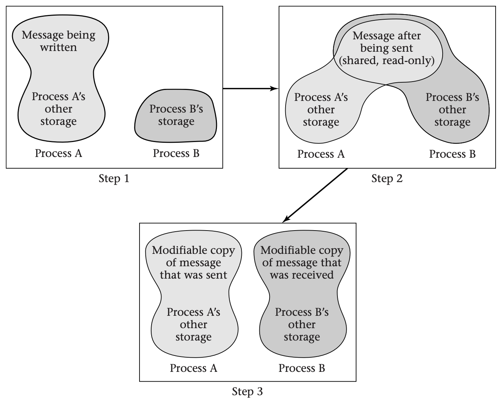
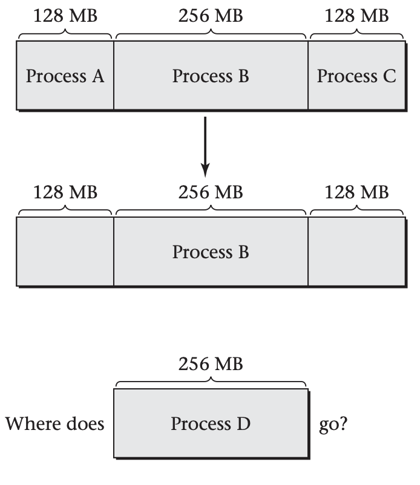
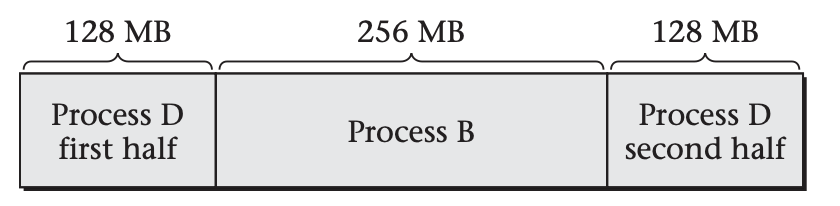
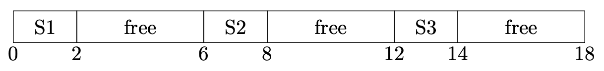

# Uses for Virtual Memory

This section contains a catalog of uses for virtual memory. The applications of virtual memory enumerated are all in everyday use in most general-purpose operating systems. A comprehensive list would be much longer and would include some applications that have thus far been limited to research systems or other esoteric settings.

## Private Storage

The introductory section of this module has already explained that each computation running on a computer may want to have its own private storage, independent of the other computations that happen to be running on the same computer. This goal of private storage can be further elaborated into two subgoals:

- Each computation should be able to use whatever virtual addresses it finds most convenient for its objects, without needing to avoid using the same address as some other computation.

- Each computation's objects should be protected from accidental (or malicious) access by other computations.

Both subgoals--independent allocation and protection--can be achieved by giving the computations their own virtual memory mappings. This forms the core of the process concept.

A *process* is a group of one or more threads with an associated protection context. The phrase "protection context" is intentionally broad, including such protection features as file access permissions. For now, I will focus on one particularly important part of a process's context: the mapping of virtual addresses to physical addresses. In other words, for the purposes of this module, a process is a group of threads that share a virtual address space.

The computer hardware and operating system software collaborate to achieve protection by preventing any software outside the operating system from updating the MMU's address mapping. Thus, each process is restricted to accessing only those physical memory locations that the operating system has allocated as page frames for that process's pages. Assuming that the operating system allocates different processes disjoint portions of physical memory, the processes will have no ability to interfere with one another. The physical memory areas for the processes need only be disjoint at each moment in time; the processes can take turns using the same physical memory.

This protection model, in which processes are given separate virtual address spaces, is the mainstream approach today.

## Controlled Sharing

Although the norm is for processes to use disjoint storage, sometimes the operating system will map a limited portion of memory into more than one process's address space. This limited sharing may be a way for the processes to communicate, or it may simply be a way to reduce memory consumption and the time needed to initialize memory. Regardless of the motivation, the shared physical memory can occupy a different range of virtual addresses in each process. (If this flexibility is exercised, the shared memory should not be used to store pointer-based structures, such as linked lists, because pointers are represented as virtual addresses.)

The simplest example of memory-conserving sharing occurs when multiple processes are running the same program. Normally, each process divides its virtual address space into two regions:

- A read-only region holds the machine language instructions of the program, as well as any read-only data the program contains, such as the character strings printed for error messages. This region is conventionally called the *test* of the program.

- A read/write region holds the rest of the process's data. (Many systems actually use two read/write regions, one for the stack and one for other data.)

All processes running the same program can share the same text. The operating system maps the text into each process's virtual memory address space, with the protection bits in the MMU set to enforce read-only access. That way, the shared text does not accidentally become a communication channel.

### Interprocess Communication

Modern programs make use of large libraries of supporting code. For example, there is a great deal of code related to graphical user interfaces that can be shared among quite different programs, such as a web browser and a spreadsheet. Therefore, operating systems allow processes to share these libraries with read-only protection, just as for main programs. Microsoft refers to shared libraries as *dynamic-link libraries* (*DLLs*).

The below figure illustrates how processes can share in read-only form both program text and the text of DLLs. In this figure, processes A and B are running program 1, which uses DLLs 1 and 2. Processes C and D are running program 2, which uses DLLs 1 and 3. Each process is shown as encompassing the appropriate program text, DLLs, and writable data area. In other words, each process encompasses those areas mapped into its virtual address space.

From the operating system's perspective, the simplest way to support *interprocess communication* is to map some physical memory into two processes' virtual address spaces with full read/write permissions. Then the processes can communicate freely; each writes into the shared memory and reads what the other one writes. The below figure illustrates this sharing of a writable area of memory for communication.

Simple as this may be for the operating system, it is anything but simple for the application programmers. They need to include mutexes, readers-writers locks, or some similar synchronization structure in the shared memory, and they need to take scrupulous care to use those locks. Otherwise, the communicating processes will exhibit races, which are difficult to debug.

### Message Passing

Therefore, some operating systems (such as Mac OS X) use virtual memory to support a more structured form of communication, known as *message passing*, in which one process writes a message into a block of memory and then asks the operating system to send the message to the other process. The receiving process seems to get a copy of the sent message. For small messages, the operating system may literally copy the message from one process's memory to the other's. For efficiency, though, large messages are not actually copied. Instead, the operating system updates the receiver's virtual memory map to point at the same physical memory as the sender's message; thus, sender and receiver both have access to the message, without it being copied. To maintain the ease of debugging that comes from message passing, the operating system marks the page as read-only for both the sender and the receiver. Thus, they cannot engage in any nasty races. Because the sender composes the message before invoking the operating system, the read-only protection is not yet in place during message composition and so does not stand in the way.

As a final refinement to message passing by read-only sharing, systems such as Mac OS X offer *copy on write* (*COW*). If either process tries to write into the shared page, the MMU will use an interrupt to transfer control to the operating system. The operating system can then make a copy of the page, so that the sender and receiver now have their own individual copies, which can be writable. The operating system resumes the process that was trying to write, allowing it to now succeed. This provides the complete illusion that the page was copied at the time the message was sent, as shown in this figure:

To use copy on write (COW) message passing, process A writes a message into part of its private memory (Step 1) and then asks the operating system to map the memory containing the message into process B’s address space as well (Step 2). Neither process has permission to write into the shared area. If either violates this restriction, the operating system copies the affected page, gives each process write permission for its own copy, and allows the write operation to proceed (Step 3). The net effect is the same as if the message were copied when it was sent, but the copying is avoided if neither process writes into the shared area. The advantage is that if the processes do not write into most message pages, most of the copying is avoided.

## Flexible Memory Allocation

The operating system needs to divide the computer's memory among the various processes, as well as retain some for its own use. At first glance, this memory allocation problem doesn't seem too difficult. If one process needs 8 megabytes (MB) and another needs 10, the operating system could allocate the first 8 MB of the memory (with the lowest physical addresses) to the first process and the next 10 MB to the second. However, this kind of contiguous allocation runs into two difficulties.

The first problem with contiguous allocation is that the amount of memory that each process requires may grow and shrink as the program runs. If the first process is immediately followed in memory by the second process, what happens if the first process needs more space?

The second problem with contiguous allocation is that processes exit, and new processes (with different sizes) are started. Suppose you have 512 MB of memory available and three processes running, of sizes 128 MB, 256 MB, and 128 MB. Now suppose the first and third processes terminate, freeing up their 128-MB chunks of memory. Suppose a 256 MB process now starts running. There is enough memory available, but not all in one contiguous chunk, as illustrated below:

This situation is known as *external defragmentation*. 

Because all modern general-purpose systems have virtual memory, these contiguous allocation difficulties are a non-issue for main memory. The operating system can allocate any available physical page frames to a process, independent of where they are located in memory. For example, the above conundrum of could be solved as shown below:

In a more realistic setting, it would be surprising for the pattern of physical memory allocation to display even this degree of contiguity. However, the virtual addresses can be contiguous even if the physical addresses are scattered all over the memory.

## Sparse Address Spaces

Just as virtual memory provides the operating system with flexibility in allocating physical memory space, it provides each application program (or process) with flexibility in allocating virtual address space. A process can use whatever addresses make sense for its data structures, even if there are large gaps between them. This provides flexibility for the compiler and runtime environment, which assign addresses to the data structures.

Suppose, for example, that a process has three data structures (S1, S2, and S3) that it needs to store. Each needs to be allocated in a contiguous range of addresses, and each needs to be able to grow at its upper end. The picture might look like this, with addresses in megabytes: 

In this example, only one third of the 18-MB address range is actually occupied. If you wanted to allow each structure to grow more, you would have to position them further apart and wind up with an even lower percentage of occupancy. Many real processes span an address range of several gigabytes without using anywhere near that much storage. (Typically, this is done to allow one region to grow up from the bottom of the address space and another to grow down from the top.)

In order to allow processes to use this kind of *sparse address space* without wastefully occupying a corresponding amount of physical memory, the operating system simply doesn't provide physical address mappings for virtual addresses in the gaps.

## Persistence

Any general-purpose operating system must provide some way for users to retain important data even if the system is shut down and restarted. Most commonly, the data is kept in files, although other kinds of persistent objects can be used. The persistent objects are normally stored on disk. For example, as I write this module, I am storing it in files on disk. That way, I don't have to retype the whole module every time the computer is rebooted. So, how does this relate to virtual memory?

When a process needs to access a file (or other persistent object), it can ask the operating system to map the file into its address space. The operating system doesn't actually have to read the whole file into memory. Instead, it can do the reading on a demand-driven basis. Whenever the process accesses a particular page of the file for the first time, the MMU signals a page fault. The operating system can respond by reading that page of the file into memory, updating the mapping information, and resuming the process. (For efficiency reasons, the operating system might choose to fetch additional pages at the same time, on the assumption they are likely to be needed soon.)

If the process writes into any page that is part of a mapped file, the operating system must remember to write the page back to disk, in order to achieve persistence. For efficiency, the operating system should not write back pages that have not been modified since they were last written back or since they were read in. This implies the operating system needs to know which pages have been modified and hence are not up to date on disk. (These are called *dirty* pages.)

One way to keep track of dirty pages, using only techniques I have already discussed, is by initially marking all pages read-only. That way, the MMU will generate an interrupt on the first attempt to write into a clean page. The operating system can then make the page writable, add it to a list of dirty pages, and allow the operation to continue. When the operating system makes the page clean again, by writing it to disk, it can again mark the page read-only.

Because keeping track of dirty pages is such a common requirement and would be rather inefficient using the approach just described, MMUs generally provide a more direct approach. In this approach, the MMU keeps a *dirty bit* for each page. Any write into the page causes the hardware to set the dirty bit without needing operating system intervention. The operating system can later read the dirty bits and reset them. (The Intel Itanium architecture contains a compromise: the operating system sets the dirty bits, but with some hardware support. This provides the flexibility of the software approach without incurring so large a performance cost.)

## Demand-Driven Program Loading

One particularly important case in which a file gets mapped into memory is running a program. Each executable program is ordinarily stored as a file on disk. Conceptually, running a program consists of reading the program into memory from disk and then jumping to the first instruction.

However, many programs are huge and contain parts that may not always be used. For example, error handling routines will get used only if the corresponding errors occur. In addition, programs often support more features and optional modes than any one user will ever need. Thus, reading in the whole program is quite inefficient.

Even in the rare case that the whole program gets used, an interactive user might prefer several short pauses for disk access to one long one. In particular, reading in the whole program initially means that the program will be slow to start, which is frustrating. By reading in the program incrementally, the operating system can start it quickly at the expense of brief pauses during operation. If each of those pauses is only a few tens of milliseconds in duration and occurs at the time of a user interaction, each will be below the threshold of human perception.

In summary, operating system designers have two reasons to use virtual memory techniques to read in each program on a demand-driven basis: in order to avoid reading unused portions and in order to quickly start the program's execution. As with more general persistent storage, each page fault causes the operating system to read in more of the program.

One result of demand-driven program loading is that application programmers can make their programs start up more quickly by grouping all the necessary code together on a few pages. Of course, laying out the program text is really not a job for the human application programmer, but for the compiler and linker. Nonetheless, the programmer may be able to provide some guidance to these tools.

## Efficient Zero Filling

For security reasons, as well as for ease of debugging, the operating system should never let a process read from any memory location that contains a value left behind by some other process that previously used the memory. Thus, any memory not occupied by a persistent object should be cleared out by the operating system before a new process accesses it.

Even this seemingly mundane job--filling a region of memory with zeros--benefits from virtual memory. The operating system can fill an arbitrarily large amount of virtual address space with zeros using only a single zeroed-out page frame of physical memory. All it needs to do is map all the virtual pages to the same physical page frame and mark them as read-only.

In itself, this technique of sharing a page frame of zeros doesn't address the situation where a process writes into one of its zeroed pages. However, that situation can be handled using a variant of the COW technique mentioned previously. When the MMU interrupts the processor due to a write into the read-only page of zeros, the operating system can update the mapping for that one page to refer to a separate read/write page frame of zeros and then resume the process.

If it followed the COW principle literally, the operating system would copy the read-only page frame of zeros to produce the separate, writable page frame of zeros. However, the operating system can run faster by directly writing zeros into the new page frame without needing to copy them out of the read-only page frame. In fact, there is no need to do the zero filling only on demand. Instead, the operating system can keep some spare page frames of zeros around, replenishing the stock during idle time. That way, when a page fault occurs from writing into a read-only page of zeros, the operating system can simply adjust the address map to refer to one of the spare prezeroed page frames and then make it writable.

When the operating system proactively fills spare page frames with zeros during idle time, it should bypass the processor's normal cache memory and write directly into main memory. Otherwise, zero filling can seriously hurt performance by displacing valuable data from the cache.

## Substituting Disk Storage for RAM

In explaining the application of virtual memory to persistence, I showed that the operating system can read accessed pages into memory from disk and can write dirty pages back out to disk. The reason for doing so is that disk storage has different properties from main semiconductor memory (RAM). In the case of persistence, the relevant difference is that disk storage is nonvolatile; that is, it retains its contents without power. However, disk differs from RAM in other regards as well. In particular, it is a couple orders of magnitude cheaper per gigabyte. This motivates another use of virtual memory, where the goal is to simulate having lots of RAM using less-expensive disk space. Of course, disk is also five orders of magnitude slower than RAM, so this approach is not without its pitfalls.

Many processes have long periods when they are not actively running. For example, on a desktop system, a user may have several applications in different windows--a word processor, a web browser, a mail reader, a spreadsheet--but focus attention on only one of them for minutes or hours at a time, leaving the others idle. Similarly, within a process, there may be parts that remain inactive. A spreadsheet user might look at the online help once, and then not again during several days of spreadsheet use.

This phenomenon of inactivity provides an opportunity to capitalize on inexpensive disk storage while still retaining most of the performance of fast semiconductor memory. The computer system needs to have enough RAM to hold the *working set*--the active portions of all active processes. Otherwise, the performance will be intolerably slow, because of disk accesses made on a routine basis. However, the computer need not have enough RAM for the entire storage needs of all the processes: the inactive portions can be shuffled off to disk, to be paged back in when and if they again become active. This will incur some delays for disk access when the mix of activity changes, such as when a user sets the word processor aside and uses a spreadsheet for the first time in days. However, once the new working set of active pages is back in RAM, the computer will again be as responsive as ever.

Much of the history of virtual memory focuses on this one application, dating back to the invention of virtual memory in the early 1960s. (At that time, the two memories were magnetic cores and magnetic drum, rather than semiconductor RAM and magnetic disk.) Even though this kind of paging to disk has become only one of many roles played by virtual memory, I will still pay it considerable attention. In particular, some of the most interesting policy questions arise only for this application of virtual memory. When the operating system needs to free up space in overcrowded RAM, it needs to guess which pages are unlikely to be accessed soon. I will come back to this topic (so-called replacement policies) after first considering other questions of mechanism and policy that apply across the full spectrum of virtual memory applications.