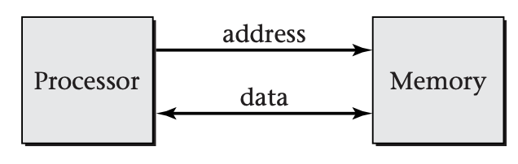

# Virtual Memory

In this module, we will present a mechanism, virtual memory , that can be used to provide threads and processes with private storage, thereby controlling their interaction. However, virtual memory turns out to be a very general-purpose abstraction, useful for many goals other than just giving threads some privacy. Therefore, after using this introductory section to present the basic concept of virtual memory, we will survey the applications of virtual memory. Afterward we will turn to the details of mechanisms and policies;

The essence of virtual memory is to decouple the addresses that running programs use to identify objects from the addresses that the memory uses to identify storage locations. The former are known as *virtual addresses* and the latter as *physical addresses*. As background for understanding this distinction, consider first a highly simplified diagram of a computer system, without virtual memory, as shown below

In this system, the processor sends an address to the memory whenever it wants to store a value into memory or load a value from memory. The data being loaded or stored is also transferred in the appropriate direction. Each load operation retrieves the most recent value stored with the specified address. Even though the processor and memory are using a common set of addresses to communicate, the role played by addresses is somewhat different from the perspective of the processor than from the perspective of the memory, as we will now explain.

## Addresses from Processor's Perspective

From the perspective of the processor (and the program the processor is executing), addresses are a way of differentiating stored objects from one another. If the processor stores more than one value, and then wishes to retrieve one of those values, it needs to specify which one should be retrieved. Hence, it uses addresses essentially as names. Just as an executive might tell a clerk to "file this under 'widget suppliers' " and then later ask the clerk to "get me that document we filed under 'widget suppliers'," the processor tells the memory to store a value with a particular address and then later loads from that address. Addresses used by executing programs to refer to objects are known as *virtual addresses*.

Of course, virtual addresses are not arbitrary names; each virtual address is a number. The processor may make use of this to give a group of related objects related names, so that it can easily compute the name of any object in the group. The simplest example of this kind of grouping of related objects is an array. All the array elements are stored at consecutive virtual addresses. That allows the virtual address of any individual element to be computed from the base virtual address of the array and the element's position within the array.

From the memory's perspective, addresses are not identifying names for objects, but rather are spatial locations of storage cells. The memory uses addresses to determine which cells to steer the data into or out of. Addresses used by the memory to specify storage locations are known as *physical addresses*. The following shows the processor's and memory's views of addresses in a system like that shown above, where the physical addresses come directly from the virtual addresses, and so are numerically equal.

## Memory Management Units

The difference between the processor's and memory's perspectives becomes apparent when you consider that the processor may be dividing its time between multiple programs. As we have discussed, the operating system represents running programs as *processes*. Sometimes the processes will each need a private object, yet the natural name to use will be the same in more than one process. The following figure shows how this necessitates using different addresses in the processor and the memory. That is, *virtual addresses can no longer be equal to physical addresses*. In this diagram, each process uses the virtual address 0 as a name for its own triangle. This is a simplified model of how more complicated objects are referenced by real processes.

To make this work, general-purpose computers are structured as shown below:

Program execution within the processor works entirely in terms of virtual addresses. However, when a load or store operation is executed, the processor sends the virtual address to an intermediary, the *memory management unit* (*MMU*). The MMU translates the virtual address into a corresponding physical address, which it sends to the memory.

Consider next a more realistic example of why each process might use the same virtual addresses for its own objects. Suppose several copies of the same spreadsheet program are running. Each copy will naturally want to refer to "the spreadsheet," but it should be a different spreadsheet object in each process. Even if each process uses a numerical name (that is, a virtual address), it would be natural for all running instances of the spreadsheet program to use the same address; after all, they are running the same code. Yet from the memory's perspective, the different processes' objects need to be stored separately---hence, at different physical addresses.

The same need for private names arises, if not quite so strongly, even if the concurrent processes are running different programs. Although in principle each application program could use different names (that is, virtual addresses) from all other programs, this requires a rather unwieldy amount of coordination.

Even for shared objects, addresses as names behave somewhat differently from addresses as locations. Suppose two processes are communicating via a shared bounded buffer; one is the producer, while the other is the consumer. From the perspective of one process, the buffer is the "output channel," whereas for the other process, it is the "input channel." Each process may have its own name for the object; yet, the memory still needs to store the object in one location. This holds true as well if the names used by the processes are numerical virtual addresses.

Thus, once again, virtual addresses and physical addresses should not be forced to be equal; it should be possible for two processes to use the same virtual address to refer to different physical addresses or to use different virtual addresses to refer to the same physical address.

You have seen that the MMU maps virtual addresses to physical addresses. However, I have not yet discussed the nature of this mapping. So far as anything up to this point goes, the mapping could be as simple as computing each physical address as twice the virtual address. However, that would not yield the very general mechanism known as virtual memory. Instead, virtual memory must have the following additional properties:

- The function that maps virtual addresses to physical addresses is represented by a table, rather than by a computational rule (such as doubling). That way, the mapping can be much more general and flexible.

- However, to keep its size manageable, the table does not independently list a physical address for each virtual address. Instead, the virtual addresses are grouped together into blocks known as *pages*, and the table shows for each page of virtual addresses the corresponding of physical addresses.

- The contents of the table are controlled by the operating system. This includes both incremental adjustments to the table and wholesale changes of the table when switching between threads. The latter allows each thread to have its own private virtual address space, in which case, the threads belong to different processes.

- The table need not contain a physical address translation for every page of virtual addresses; in effect, some entries can be left blank. These undefined virtual addresses are illegal for the processor to use. If the processor generates an illegal address, the MMU interrupts the processor, transferring control to the operating system. This interrupt is known as a *page fault*. This mechanism serves not only to limit the usable addresses but also to allow address translations to be inserted into the table only when needed. By creating address translations in this demand-driven fashion, many applications of virtual memory arrange to move data only when necessary, thereby improving performance.

- As a refinement of the notion of illegal addresses, some entries in the table may be marked as legal for use, but only in specific ways. Most commonly, it may be legal to read from some particular page of virtual addresses but not to write into that page. The main purpose this serves is to allow trouble-free sharing of memory between processes.

In summary, virtual memory consists of an operating system-defined table of mappings from virtual addresses to physical addresses (at the granularity of pages), with the opportunity for intervention by the operating system on accesses that the table shows to be illegal. You should be able to see that this is a very flexible mechanism. The operating system can switch between multiple views of the physical memory. Parts of physical memory may be completely invisible in some views, because no virtual addresses map to those physical addresses. Other parts may be visible in more than one view, but appearing at different virtual addresses. Moreover, the mappings between virtual and physical addresses need not be established in advance. By marking pages as illegal to access, and then making them available when an interrupt indicates that they are first accessed, the operating system can provide mappings on a demand-driven basis. 